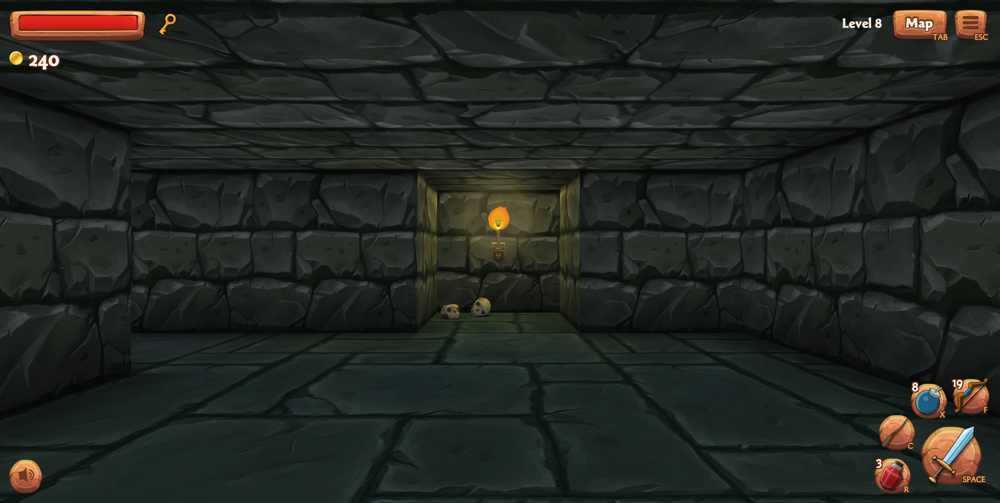
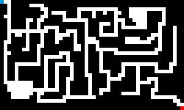
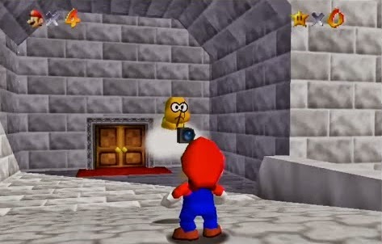
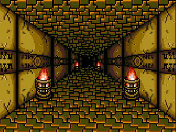

# Trabalho Prático 2 - Masmorras e Dragões

Neste trabalho, nosso objetivo é **criar um labirinto**. Nosso
objetivo é praticar os conceitos de projeção, iluminação, modelagem e
efeitos visuais vistos em sala de aula.
Um exemplo de labirinto pode ser visto no jogo
[_"Keep Out"_][keep-out-official-site].

Vídeos do Keep Out:

- [_"First Exploration!"_][keep-out-first-exploration]
- [_"Demons Everywhere!"_][keep-out-demons-everywhere]
- [_"Death!"_][keep-out-death]

Esse trabalho pode ser feito individualmente, ou em dupla, e
como funcionalidade básica, valendo 80% ou 65% (respectivamente) da
nota, deve ter os seguintes itens:

- **Mundo**:
  1. O mapa deve ser carregado a partir dos pixels de uma imagem, onde as cores:
    - Azul: Ponto inicial.
    - Vermelho: Ponto final.
    - Preto: Lugares inacessivéis.
    - Branco: Caminhos possíveis.
      Exemplo de mapa:

        

    **Obs: na imagem, cada pixel se refere a uma região do mundo** - a imagem
    real a ser usada seria esta:
    
  1. O personagem não pode atravessar objetos.
    - O caminho pode ser um plano; As paredes podem ser sólidos da GLU
      e FreeGLUT (e.g., cubos) ou planos cercando o caminho;
  1. O fim deve teletransportar o usuário/jogador para o início.
- **Personagem**:
  - Ela deve possuir ao menos um corpo e 2 "pernas" para andar, deve
    executar algum movimento ao andar (não precisa ser um movimento
    perfeito mas, pelo menos, mexer apenas enquanto está andando).
    - Caso não queira modelá-lo com pernas, você pode criar algo semelhante,
      contanto que seja feita a modelagem de forma hierárquica (_i.e._, com
      `glPushMatrix()...glPopMatrix` aninhados)
  - Pode ser controlada pelo usuário com as _"arrow keys"_:
    - <kbd>A</kbd> ou <kbd>&larr;</kbd> rotacionam 90º para esquerda;
    - <kbd>D</kbd> ou <kbd>&rarr;</kbd> rotacionam 90º para direita;
    - <kbd>W</kbd> ou <kbd>&uarr;</kbd> andam para frente;
    - <kbd>S</kbd> ou <kbd>&Darr;</kbd> andam para trás.
- **Câmera**:
  1. Você deve usar projeção perspectiva via `glFrustum` ou `gluPerspective`.
  1. A câmera deve acompanhar o personagem
  1. Devem existir 2 tipos de câmeras e, ao pressionar a tecla <kbd>c</kbd>,
    seu programa deve alternar entre elas:
    - câmera posicionada atrás do personagem:

      
    - câmera em primeira pessoa:

      
      - Rotacionar 90º para esquerda ao apertar a tecla <kbd>A</kbd> ou
        <kbd>&larr;</kbd>;
      - Rotacionar 90º para direita ao apertar a tecla <kbd>D</kbd> ou
        <kbd>&rarr;</kbd>;
      - Movimentar junto com o personagem a partir das teclas <kbd>W</kbd> ou <kbd>&uarr;</kbd> para frente;
      - Movimentar junto com o personagem a partir das teclas <kbd>S</kbd> ou <kbd>&darr;</kbd> para trás;
- **Gráficos**:
  1. Você deve usar o modelo de
    [iluminação do OpenGL, devidamente configurado][lighting].
    - Basta que sua cena tenha 1
    [fonte de luz direcional][lighting-directional].
  1. Todas as paredes e objetos da cena devem ter materiais configurados (não
    necessariamente com textura).

Para se obter o restante dos pontos do trabalho (ou até mesmo mais pontos
extras, até um limite de **125%** da pontuação original)
funcionalidades adicionais podem/devem ser implementadas no jogo.
Essas funcionalidades serão avaliadas conforme a **dificuldade da
implementação**, o **efeito obtido** com ela no trabalho e a **qualidade da implementação**. Exemplos de funcionalidades extras com suas
respectivas pontuações **máximas**:

- **Objetos** no labirinto:
  1. :star2: **Tipos diferentes de objetos (até 10%)**: pode haver
    vários tipos de objetos na cena, como pedras, tochas, caveiras, baús etc.
    - Esses itens podem ser representados na imagem do mapa usando-se
      cores diferentes, ou então eles podem estar distribuídos
      aleatoriamente de forma interessante
    - Eles podem ser modelados como sólidos GLU/FreeGLUT
  1. :bomb: :boom: **Modelos no formato .obj (até 10%)**: em vez de usar os
    sólidos da GLU/FreeGLUT, modele objetos \*simples\* usando um _software_
    CAD, salve-o num formato \*simples\* (_e.g._, `.obj`) e carregue-o no
    seu programa. Há alguns tutoriais disponíveis nas _interwebs_ sobre
    como abrir um arquivo `.obj`, ler a informação sobre os vértices e
    desenhá-los... aqui estão alguns: [tutorial 1][obj-tut-1],
    [tutorial 2][obj-tut-2], [tutorial 3][obj-tut-3].
- Relativas ao **Mapa**:
  1. :star2: **Tipos de terrenos** diferentes: em vez de apenas um tipo de terreno
    (ou chão), use outras cores na imagem que representa o mapa para, por
    exemplo, terreno de água, de metal, de tijolo, de madeira etc.
  1. :bomb: :bomb: **Mapas de forma procedural (até 12%)**: em vez
    de carregar o mapa a partir da imagem, gere mapas aleatórios que
    obedeçam as restrições; Você deve procurar por algoritmos de geração
    procedural de labirintos - veja o
    [gerador de labirintos do Thales Bacelar][labirintos-procedurais-thales]
    como exemplo.
  1. :star: **Múltiplos cenários (até 6%)**: em vez de instanciar um mapa
    único, crie outros mapas e mude ao passar de fase, em vez de
    teletransportar o jogador para o início;
- Relativas ao **Personagem**:
  1. :star2: **Salto (até 4%)**: faça com que
    o personagem salte, por exemplo com a <kbd>barra de espaço</kbd>;
- Relativas à **Câmera**:
  1. **Rotação suave (5%)**: ao rotacionar a câmera 90º, essa
    transformação deve ser interpolada ao longo do tempo (e.g., 200ms)
    em vez de acontecer "abruptamente"
  1. :star2: **Reshape (3%)**: permitir o redimensionamento da janela
    de visualização sem perda da razão de aspecto (sem que haja distorção
    de achatamento/alongamento).
- Relativas a **Gráficos**:
  1. :star2: Neblina (**3%**): a partir de uma certa distância
  1. Fontes de **luz pontual (até 7%)**: além da fonte luminosa direcional,
    crie uma ou mais fontes de luz pontuais em pontos estratégicos. Como
    por exemplo, nas tochas!
    - Faça as fontes de luz "trepidarem", imitando a forma como as chamas
      se comportam (**+3%**)
  1. :collision: **_Skybox_ (até 5%)**: se considerarmos que nosso mundo
    está definido dentro de um cubo, podemos colocar uma imagem de textura
    em cada face interna (6) que represente o horizonte naquela direção. Veja
    [exemplos de texturas de _skyboxes_][skybox] e nossa aula sobre
    [efeitos visuais][visual-fx]. Repare que o cubo _skybox_ acompanha
    a posição, ou seja, não é possível se aproximar (e até sair) do cubo.
  1. :bomb: **Efeitos de partículas (até 12%)**: use sistemas de
    partículas para fazer uma simulação interessante sobre fogo, por exemplo.
  1. :bomb: **Sombras dinâmicas (até 12%)**: gere sombras dinamicamente
    usando as técnicas de _shadow maps_ ou _shadow volumes_
- Outros adicionais:
  1. :star2: **Modo _cheat_ (5%)**: faça com que uma linha mostre o
    caminho direto.
  1. **Outro tema (0%)**: por que se limitar a fazer um simples
    labirinto, quando se pode libertar o ser criativo dentro de você!
  1. :star2: **Música (até 5%)**: você pode incluir ambientação sonora para
    seu labirinto que pode incluir uma música ambiente e efeitos sonoros.
  1. :bomb: :bomb: **Modelo de iluminação != Phong (até 8%)**: use os recursos
    de programabilidade do pipeline gráfico e crie seus próprios sombreadores
    (_vertex shader_ e _fragment shader_)
- **Qualquer outra idéia (??%)** que torne o labirinto mais interessante ou
  agradável aos sentidos. Essas idéias precisam ser documentadas e
  explicadas no documento de entrega do trabalho (`README.txt`).

Legenda dos ícones:
  - :star2:: item sugerido por ser interessante ou super simplão.
  - :collision:: item com maior complexidade de implementação - não
    comece por estes!!
  - :bomb:: item com alta complexidade de implementação - Deixe para o fim!!
  - :bomb::bomb:: Bombas... nível hardcore!

## Instruções gerais

O trabalho pode ser feito individualmente ou em duplas e deve ser produzido
integralmente pelos aluno ou dupla. Podem discutir idéias com outros colegas,
mas cada aluno/dupla deve ter a sua implementação independente dos demais.
**Trabalhos muito semelhantes receberão notas muito semelhantes (iguais a 0)**,
independente de quem copiou de quem. Trabalhos semelhantes aos de outras
pessoas (ex-alunos, pessoas na Internet) também receberão nota 0.

## O que faz perder nota

Alguns descuidos podem fazer com que sua nota fique abaixo do esperado:
- Seu trabalho não executa: nota 0
- Cópia de trabalho de outrem: nota 0
- Ausência de qualquer item obrigatório da entrega (descrito na próxima seção)
- Ausência de itens da especificação obrigatória
- Baixa legibilidade do código
- Baixa qualidade da implementação
- Atraso na entrega. Cada dia de atraso reduz o valor máximo de nota da
 maneira abaixo. Considere `x` como dias de atraso e `y` a penalidade
 percentual na nota:

 
 - Isso implica que 1 ou 2 dias de atraso são pouco penalizados
 - E após 5 dias de atraso, o trabalho vale 0
 - _Seeing is believing_: https://www.google.com.br/search?q=y%3D(2%5E(x-2)%2F0.16)%2Cy%3D100

## O que deve ser **entregue**

Deve ser entregue **um arquivo .tar.gz ou .zip** via **Moodle** contendo:
 1. 3+ _screenshots_ de diferentes cenas do seu jogo
 1. Todo o programa fonte, com os _Makefiles_ e bibliotecas necessárias
    para a compilação e execução do programa
 1. O arquivo executável
 1. Um arquivo **README** contendo:
    - Instruções para **compilação e execução**
    - **Lista de itens adicionais** que seu jogo está pleiteando
 1. [opcional, +5%] O link para um vídeo breve (_e.g._, youtube) do
    seu jogo mostrando as opções implementadas.

Qualquer dúvida, entre em contato comigo. Ou acrescente a sua interpretação no
arquivo README e mãos à obra.

[keep-out-official-site]: http://www.playkeepout.com/
[keep-out-demons-everywhere]: https://www.youtube.com/watch?v=0HXZA81ewN8
[keep-out-death]: https://www.youtube.com/watch?v=F6s-lrX_Yk4
[keep-out-first-exploration]: https://www.youtube.com/watch?v=Efo14AGLWLg
[labirintos-procedurais-thales]: https://github.com/thales-nascimento/gerador-de-labirintos
[skybox]: https://www.google.com.br/search?q=skybox&safe=off&hl=pt-BR&source=lnms&tbm=isch&sa=X&ei=jMM_VenRNKuasQSCwYDABw&ved=0CAgQ_AUoAg&biw=1366&bih=599
[lighting]: http://fegemo.github.io/cefet-cg/classes/lighting/#26
[lighting-directional]: http://fegemo.github.io/cefet-cg/classes/lighting/#37
[obj-tut-1]: http://www.opengl-tutorial.org/beginners-tutorials/tutorial-7-model-loading/
[obj-tut-2]: http://netization.blogspot.in/2014/10/loading-obj-files-in-opengl.html
[obj-tut-3]: https://tutorialsplay.com/opengl/2014/09/17/lesson-9-loading-wavefront-obj-3d-models/
[obj-distribution]: http://moodle.cefetmg.br/mod/forum/discuss.php?d=3572
[visual-fx]: http://fegemo.github.io/cefet-cg/classes/visual-effects/#4
[camera-lateral]: https://youtu.be/T7zdZ4VJ3nw
