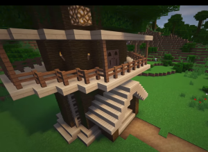
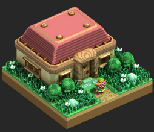

# Trabalho Prático 2 - Treehouse

Neste trabalho, vamos criar uma casinha na árvore. Ou uma casinha submarina.
Ou uma casinha no chão mesmo - basta dar pra morar. Nosso objetivo é
praticar os conceitos de projeção perspectiva, iluminação, modelagem e
efeitos visuais vistos em sala de aula. E também nos divertir.

Esse trabalho pode ser feito individualmente, ou em dupla, ou em trio, e
como funcionalidade básica, valendo 85%, 70% ou 60% (respectivamente) da
nota, deve ter os seguintes itens:

- Um **vídeo** (agora é obrigatório, mas pode ser entregue alguns
  dias depois)
- **Mundo**:
  1. Deve haver um "chão" que pode ser modelado por um plano horizontal
     - No centro do mundo, deve haver a casinha, descrita mais adiante
     - Deve haver 01 outro tipo de objeto fora da casinha, com instâncias
       espalhadas pelo cenário (_e.g._, árvores, arbustos, rochas, nuvens,
       passarinhos). É possível usar apenas sólidos GLU e GLUT para os
       objetos (composição de esferas, cilindros, cones, pirâmides, caixas etc.)
- **Casinha**:
  1. A casinha precisa ter "o lado de fora", com telhadinho, e o lado
     de dentro, com pelo menos 1 cômodo
  1. Deve haver móveis referentes ao que uma casa precisa. Pelo menos 3 tipos,
     que podem ser uma cama, uma mesa e cadeiras.
     - Os móveis podem ser feitos como uma composição de sólidos da GLU e
       GLUT (_e.g._, cone, pirâmide, cubo, esfera, caixa)
  1. Deve haver pelo menos uma porta e uma janela
     - A janela deve conter transparência (para o vidro)
     - A porta deve poder ser aberta/fechada. Você pode usar os
       [menus da freeglut][menu] para abri-la/fechá-la, ou então usar o clique
       do mouse diretamente na porta (isto dá um adicional)
  1. Deve haver um objeto que está com uma animação, como um ventilador (de
     teto, ou no chão), uma cadeira de balanço etc.
- **Câmera**:
  1. Você deve usar projeção perspectiva via `glFrustum` ou `gluPerspective`
  1. O controle da câmera pode ser feito de uma das duas formas a seguir:
     - _First-person_ modificado: o teclado (`w,a,s,d`) faz ir pra frente
       (`w`), trás  (`s`), girar poucos graus à esquerda (`a`), girar à
       direita (`d`).
     - Aérea (tipo helicóptero): posicionada mais acima, olhando sempre
       para o centro do mundo com interação via teclado (`w,a,s,d`). As teclas
       (`w,s`) aumentam ou diminuem distancia da câmera até o centro do mundo
       (_zoom_) e (`s,d`) fazem a câmera girar, concentricamente em relação à
       origem do mundo, para direita ou esquerda (pense num helicóptero
       girando para ver todos os lados de uma casa).
       - Se você optar pela câmera aérea, deve implementar também uma
         funcionalidade (uma tecla ou um menu do GLUT) para ocultar/mostrar
         o telhado da casa
- **Gráficos**:
  1. Você deve usar o modelo de
     [iluminação do OpenGL, devidamente configurado][lighting]
     - Basta que sua cena tenha 1
       [fonte de luz direcional][lighting-directional] e que todos objetos
       possuam um material
  1. Usar texturas para todos os objetos, paredes, chão etc. ou estilo
     _low-poly_ lindão sem textura

Para se obter o restante dos pontos do trabalho (ou até mesmo mais pontos
extras, até um limite de 125% da pontuação original) funcionalidades adicionais
podem/devem ser implementadas no jogo. Essas funcionalidades serão avaliadas
conforme a **dificuldade da implementação**, o **efeito obtido** com ela no
trabalho e a **qualidade da implementação**. Exemplos de funcionalidades
extras com suas respectivas pontuações **máximas**:

- Relativas à **Casa**:
  1. :star: **Mais cômodos (até 6%)**: coloque paredes internas na casa,
     dividindo cômodos. Eles devem conter móveis diferentes, de acordo
     com sua função
  1. **Arquitetura mais rebuscada (até 6%)**: em vez de fazer com um
     telhado colonial simples, libere o arquiteto dentro de você
  1. **Área externa da casa (até 8%)**: faça um jardim, uma piscina ou
     outras coisas que normalmente aparecem do lado/atrás da casa. Pode
     ser a árvore que segura a casa também
- Relativas aos **Móveis/Objetos**:
  1. :star: **Vários tipos (até 10%)**: em vez de apenas 01 tipo de
     objeto externo e 03 tipos de móveis, pode ter vários outros: armários,
     prateleiras, sofá, televisão, lareira, cocho (!?), uma TV, quadros
     na parede, porta-retrato, rack
  1. :bomb: **Modelos no formato .obj (até 10%)**: em vez de usar os
     sólidos da GLU/GLUT, modele um objeto \*simples\* usando um _software_
     CAD, salve-o num formato \*simples\* (_e.g._, `.obj`) e carregue-o no
     seu programa. Há alguns tutoriais disponíveis nas _interwebs_ sobre
     como abrir um arquivo `.obj`, ler a informação sobre os vértices e
     desenhá-los... aqui estão alguns: [tutorial 1][obj-tut-1],
     [tutorial 2][obj-tut-2], [tutorial 3][obj-tut-3]
     - Apenas carregar modelos prontos (até 6%)
     - Modelar e carregar modelos (até 10%)
  1. **Objetos interativos (até 6%)**: torne possível que o usuário
     interaja com alguns objetos (ligando um chuveiro/torneira, ligando uma
     TV, acendendo uma lâmpada etc.)
- Relativas ao **Terreno** (chão):
  1. O chão **subdividido (4%)**: montado a partir de muitos triângulos, em
     vez de apenas um retangulão. A pressionar a tecla `f`, o chão deve
     passar de colorido a modelo de arames (_wireframes_), sendo possível
     ver a subdivisão que foi feita.
  1. :bomb: **Relevo usando textura (10%)**: você pode usar uma
     textura em escala de cinza representando o relevo do chão: um ponto branco,
     representa altura 100% e um ponto preto representa altura 0. Esta é uma
     técnica de uso de texturas chamada _height map_. Veja um
     [exemplo de _height map_][height-map] na aula sobre texturas.
- Relativas à **Câmera**:
  1. :star: Implementar **as duas câmeras (5%):** e usar a tecla `c` ou
     então `1` e `2` para alternar entre elas.
  1. Câmera **_first-person_ tradicional (até 7%)**: em vez das teclas
     (`a,d`) girarem a câmera, elas vão fazê-la andar de lado. E a posição do
     mouse deve ser usada para alterar para onde a câmera está olhando. Esta é
     a câmera padrão de jogos em primeira pessoa.
  1. **_Head bobbing_ (até 5%)** na câmera _first-person_: ao mover a câmera,
     em vez de deixar sua coordenada Z intacta, aplique uma função matemática,
     cíclica (_e.g._, `sin(t)`, `cos(t)`, [`abs(sin(t))`][bob-abs-sin]) para
     variá-lo e ter a sensação de que é uma pessoa andandando que está
     segurando a câmera.
  1. :bomb: **Colisão com objetos (até 10%)**: faça sua câmera
     _first-person_ evitar entrar dentro dos objetos da cena fazendo
     verificações de colisão com eles. Para efeitos dessa verficação,
     você pode simplificar e fingir que cada objeto é apenas um cilindro
     (que o contém) e impedir que a câmera "entre" nesse cilindro.
- Relativas a **Recursos do OpenGL**:
  1. **Usar VBOs e VAOs (até 12%)** em vez de `glVertex(...)`: para ter
     um desempenho altíssimo e fazer as coisas do jeito do OpenGL 3+
     - Obs: as primitivas GLU/GLUT usam `glVertex`, logo, são incompatíveis com
       este adicional
- Relativas a **Gráficos**:
  1. Fonte de **luz pontual (5%)**: além da fonte luminosa direcional, crie uma
     ou mais fontes de luz pontuais em pontos estratégicos.
  1. :star2: **Reshape (3%)**: permitir o redimensionamento da janela
     de visualização sem perda da razão de aspecto (sem que haja distorção
     de achatamento/alongamento)
  1. **Efeitos de partículas (até 8%)**: para simular fenômenos como fogo,
     fumaça, água etc. Falaremos disso na aula de [efeitos visuais][visual-fx]
  1. **_Skybox_ (até 8%)**: se considerarmos que nosso mundo
     está definido dentro de um cubo, podemos colocar uma imagem de textura
     em cada face interna (6) que represente o horizonte naquela direção. Veja
     [exemplos de texturas de _skyboxes_][skybox] e nossa aula sobre
     [efeitos visuais][visual-fx]. Repare que o cubo _Skybox_ acompanha
     a posição, ou seja, não é possível se aproximar (e até sair) do cubo.
  1. **Dia/noite (até 10%)**: você pode fazer o tempo passar ao longo do dia
     e fazer com que isso reflita na forma como a cena é renderizada. Isto pode
     ser feito configurando-se a fonte de luz direcional com cores diferentes,
     dependendo da hora do dia, por exemplo. Além disso, você pode fazer com
     que certas coisas só aconteçam de dia ou de noite. Se tiver um _skybox_,
     pode alterá-lo para os horários diferentes e por aí vai
  1. :bomb::bomb: **Sombras dinâmicas (até 12%)**: use a técnica de
     _shadow maps_ ou _shadow volumes_ para criar sombras para os objetos.
     Falaremos disso na aula de [efeitos visuais][visual-fx]
- Outros adicionais:
  1. :star: **Música (3%)**: você pode incluir ambientação sonora para
     sua casa
  1. :star: **Efeitos sonoros (até 5%)**: tocar efeitos sonoros da porta
     abrindo, passos e outras interações
  1. **Qualquer outra idéia (??%)** que torne a casinha mais interessante ou
     agradável aos sentidos. Essas idéias precisam ser documentadas e
     explicadas no documento de entrega do trabalho (`README.txt`).

Legenda dos ícones:
  - :star2:: item sugerido por ser interessante ou super simplão.
  - :bomb:: item com maior complexidade de implementação - não
    comece por estes!!

## Instruções gerais

O trabalho pode ser feito individualmente ou em duplas e deve ser produzido
integralmente pelos aluno ou dupla. Podem discutir idéias com outros colegas,
mas cada aluno/dupla deve ter a sua implementação independente dos demais.
**Trabalhos muito semelhantes receberão notas muito semelhantes (iguais a 0)**,
independente de quem copiou de quem. Trabalhos semelhantes aos de outras
pessoas (ex-alunos, pessoas na Internet) também receberão nota 0.

## O que faz perder nota

Alguns descuidos podem fazer com que sua nota fique abaixo do esperado:
- Seu trabalho não executa: nota 0
- Cópia de trabalho de outrem: nota 0
- Ausência de qualquer item obrigatório da entrega (descrito na próxima seção)
- Ausência de itens da especificação obrigatória
- Baixa legibilidade do código
- Baixa qualidade da implementação
- Atraso na entrega. Cada dia de atraso reduz o valor máximo de nota da
 maneira abaixo. Considere `x` como dias de atraso e `y` a penalidade
 percentual na nota:

- Isso implica que 1 ou 2 dias de atraso são pouco penalizados
- E após 5 dias de atraso, o trabalho vale 0
- _Seeing is believing_:
  https://www.google.com.br/search?q=y%3D(2%5E(x-2)%2F0.16)%2Cy%3D100

## O que deve ser **entregue**

Deve ser entregue **um arquivo .tar.gz ou .zip** via **Moodle** contendo:
 1. 3+ _screenshots_ de diferentes cenas do seu jogo
 1. Todo o programa fonte, com os _Makefiles_ e bibliotecas necessárias
    para a compilação e execução do programa
 1. O arquivo executável
 1. Um arquivo **README** contendo:
    - Instruções para **compilação e execução**
    - **Lista de itens adicionais** que seu jogo está pleiteando
 1. O link para um vídeo de 30-60s no YouTube mostrando as opções implementadas

Qualquer dúvida, entre em contato comigo. Ou acrescente a sua interpretação no
arquivo README e mãos à obra.

[menu]: http://www.programming-techniques.com/2012/05/glut-tutorial-creating-menus-and.html
[skybox]: https://www.google.com.br/search?q=skybox&safe=off&hl=pt-BR&source=lnms&tbm=isch&sa=X&ei=jMM_VenRNKuasQSCwYDABw&ved=0CAgQ_AUoAg&biw=1366&bih=599
[lighting]: http://fegemo.github.io/cefet-cg/classes/lighting/#26
[lighting-directional]: http://fegemo.github.io/cefet-cg/classes/lighting/#37
[obj-tut-1]: http://www.opengl-tutorial.org/beginners-tutorials/tutorial-7-model-loading/
[obj-tut-2]: http://netization.blogspot.in/2014/10/loading-obj-files-in-opengl.html
[obj-tut-3]: https://tutorialsplay.com/opengl/2014/09/17/lesson-9-loading-wavefront-obj-3d-models/
[visual-fx]: http://fegemo.github.io/cefet-cg/classes/visual-effects/#4
[height-map]: http://fegemo.github.io/cefet-cg/classes/textures/#43
[bob-abs-sin]: http://www.wolframalpha.com/input/?i=abs%28sin%28x%29%29
