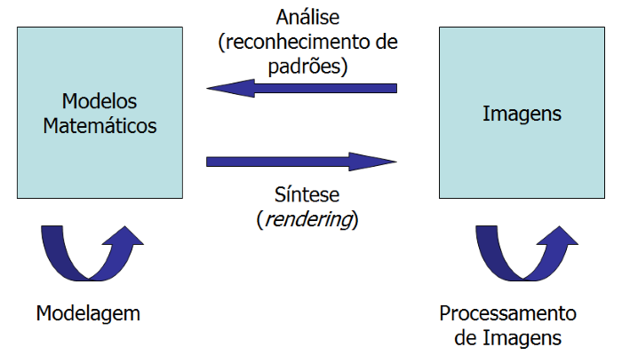
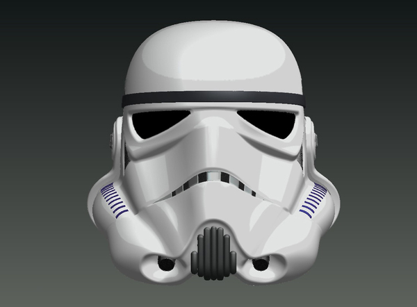
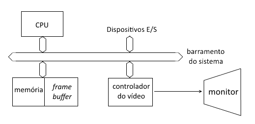
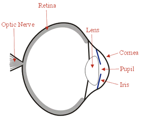

<!--
  backdrop: introduction
-->

# Introdução à Computação Gráfica

---
# Roteiro

1. Conceitos
1. Dispositivos Gráficos
1. Representação de Imagens
1. Modelos usados em Computação Gráfica

---
## Computação Gráfica

Definição: *s.f.* conjunto de **algoritmos, técnicas e metodologias** para
o **tratamento e a representação gráfica de informações** por meio da
criação, armazenamento e manipulação de desenhos por meio de
computadores e periféricos gráficos.

---
## Quem usa Computação Gráfica?

1. Jogos
1. Filmes e TV
1. CAD (_Computer Aided Design_)
1. Educação e Treinamento
1. Arte por Computador
1. Apresentações Gráficas
1. Simulação Científica

---
<!--
  backdrop: area-games
-->

# Jogos

---
<!--
  backdrop: area-entertainment
-->

# Entretenimento

<iframe src="https://player.vimeo.com/video/172374044" width="640" height="360" frameborder="0" allowfullscreen></iframe>

---
<!--
  backdrop: area-cad
-->

# CAD (_Computer Aided Design_)

---
<!--
  backdrop: area-education
-->

# Educação e Treinamento

---
<!--
  backdrop: area-art
-->

# Arte por Computador

---
## Interação com outras áreas

---
# **Problemas abordados** na área

---
## Processamento Digital de Imagens

- Área que envolve as **técnicas de transformação de imagens**, em que tanto
  a imagem original quanto a imagem resultado apresentam-se **sob uma
  representação visual** (geralmente matricial)
- Estas transformações **visam melhorar as características visuais da imagem**,
  _e.g._:
  - aumentar o contraste
  - alterar o foco
  - diminuir ruídos e algumas distorções

---
## Exemplo: Processamento Digital de Imagens

---
## Análise de Imagens

- Área que procura **obter a especificação dos componentes de uma imagem a
  partir de sua representação visual**
- Por exemplo, reconstrução de primitivas elementares
  (cubos, esferas, etc.) que aproximam um objeto visualizado em uma imagem

---
## Exemplo: Análise de Imagens

---
## Exemplo 2: Análise de Imagens

---
## Modelagem

- A modelagem geométrica consiste de um **conjunto de métodos que visam
  descrever a forma e as características geométricas de um objeto**
- Ela provê uma descrição ou modelo muito mais analítico,
  matemático e abstrato que o real

---
## Exemplo: Modelagem

---
## Síntese (ou renderização)

- A síntese de imagem designa o **processo de geração de imagens
  digitais a partir da descrição dos elementos que compõem uma cena 3D**,
  baseando-se em modelos que descrevem o comportamento da luz
- Síntese e modelagem são consideradas, por muitos autores, como
  **a própria Computação Gráfica de hoje em dia**.

---
## Exemplo: Síntese

---
## Foco deste curso

- **Modelagem e síntese** de imagens
  - Processamento de imagens é uma área por si só
  - Visão computacional estuda a análise de imagens (e vídeos)
- Teoria e prática das técnicas e algoritmos envolvidos em modelagem e síntese
- Geração de imagens em tempo real
  - Mas também veremos geração *offline*

---
## Professor, mas eu quero fazer desenhos em 3D!

- Você pode fazer isso e ganhar pontinhos extras nos trabalhos
- Contudo, o foco do curso está em conhecer e entender como funcionam as
  ferramentas utilizadas na criação de imagens e animações 3D
- Algumas ferramentas para criar cenas 3D:
  - [3ds Max](3ds-max) (licença de estudante gratuita)
  - [Maya lt](maya-lt) (licença de estudante gratuita)
  - [blender](blender) (gratuito)
  - [ZBrush](z-brush) (comercial)
  - [clara.io](claraio) (tem uma versão gratuita, programa limitado)

---
# Dispositivos Gráficos

---
## Interfaces Gráficas

- Interfaces baseadas em texto (~1980)
- Interface WIMP: Windows, Icons, Menus and Pointers
  

---
## Dispositivos Gráficos

- Monitores Raster
  - CRT
  - LCD
  - Plasma
- Monitores vetoriais (1963)
  - Imagens desenhadas como uma caneta
- Impressoras

---
## _Cathode Ray Tube_ (CRT)

- Tubo de raio catódico
- Baixo custo de produção
- Bom ângulo de visão

---
## Outros monitores

- _Liquid Cristal Display_ (LCD)
  - Cada pixel são três (rgb) "orifícios" que permitem passagem de luz branca
  - Demonstração: [Desmontando um monitor de LCD (Enginner Guy)][lcd-teardown]
- Plasma
  - Composto por um grande número de lâmpadas de neon
  - Cada pixel tem uma célula de fósforo que é incandencida por raios violeta
    emitidos pelo plasma
  - Cada pixel tem 3 (rgb) subpixels

[lcd-teardown]: http://www.engineerguy.com/videos/video-lcd.htm

---
# Arquitetura de sistema gráfico raster

---
## Modelo **Simples**

---
## Modelo **Moderno**

---
## Representação de Cores

---
## Representação de Cores

- Depende da natureza do dispositivo gráfico: aditivo (monitores) ou subtrativo
  (impressoras)
- Monitores: 24-bit RGB
  - 8 bits para vermelho (0 a 255)
  - 8 bits para verde
  - 8 bits para azul
  - Exemplo:   (255, 213, 213) ou (1, 0.84, 0.84)
    - Seletor de cores: <input type="color">

<!--
- [Questionário Maroto - parte 1](https://moodle.cefetmg.br/mod/quiz/view.php?id=17597)
-->

---
# Representação de Imagens

Imagens podem ser representadas em duas formas principais:

- Vetoriais
  - Formulados por modelos geométricos
  - Ocupam menos espaço de armazenamento
  - Não perdem qualidade quando ampliados
  - Extensões: [**svg, cdr**]
- Raster (matricial ou matriz de pixels)
  - Matriz de **pixels** (_picture elements_)
  - Muito simples de gerar
  - Extensões: [**gif, jpg, png, bmp**]

---
## Imagem vetorial

---
## Imagem raster

---
# Modelos usados em Computação Gráfica
---
## Modelos de Sistema Visual

- Há várias formas de tentar reproduzir o sistema visual:
  1. Modelo do olho humano
  1. Modelo da camera escura (estenopeica)
  1. Modelo do _frustum_ de visualização
- Vamos escolher um \o/

---
## (1) Modelo do olho humano

- 
  Fótons (raios de luz) entram pela pupila de forma reta até atingirem a retina
- A imagem é formada pela contribuição da luz nos cones da retina
- Quanto mais próximo ao centro da retina, maior o nível de detalhes que
  percebemos
- Este modelo é **complexo demais** para a Computação Gráfica
  - Basicamente porque o sistema visual humano envolve fatores até
    [mesmo psicológicos da percepção de luminosidade](http://web.mit.edu/persci/gaz/)

---
## Qual é mais escuro? A ou B?

<figure class="picture-steps">
  
  
</figure>

---
## (2) Modelo da câmera escura

---
## A Câmera _"pinhole"_

- Versão mais simples de um modelo de visão
- Imagens mais próximas são retratadas maiores
- Modelo bastante semelhante ao que usamos

---
## (3) O modelo de _View Frustum_

- A câmera é colocada na ponta da pirâmide
- **_Frustum_**: sólido geométrico que é um **tronco de pirâmide** formado pelo
  plano próximo e plano distante
- Apenas o que está dentro do _frustum_ é retratado

<!--

- [Questionário Maroto - parte 2](https://moodle.cefetmg.br/mod/quiz/view.php?id=17596)
-->

---
# Referências

- [Programa de modelagem 3D blender][blender]
- [Aplicativo Web de modelagem 3D clara.io][claraio]
- [Programa de modelagem 3D Autodesk 3ds Max][3ds-max]
- [Programa de modelagem 3D Autodesk Maya][maya-lt]
- [Programa de modelagem 3D ZBrush][z-brush]
- [Desmontando um monitor de LCD (Enginner Guy)][lcd-teardown]
- [Explicação da ilusão de ótica][optics-illusion]

[blender]: http://www.blender.org/
[claraio]: https://clara.io/
[3ds-max]: http://www.autodesk.com/education/free-software/3ds-max
[maya-lt]: http://www.autodesk.com/education/free-software/maya-lt
[z-brush]: http://pixologic.com/
[lcd-teardown]: http://www.engineerguy.com/videos/video-lcd.htm
[optics-illusion]: http://web.mit.edu/persci/people/adelson/checkershadow_description.html
