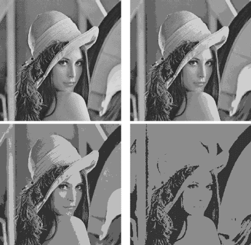
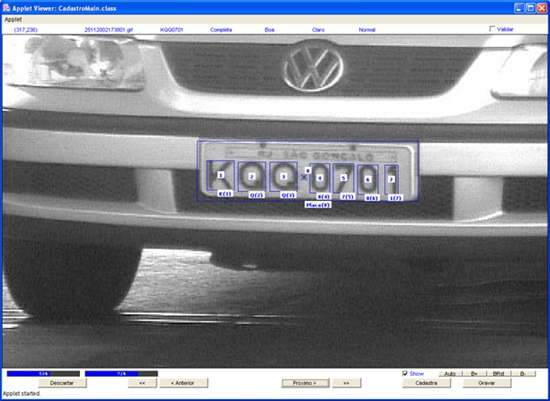
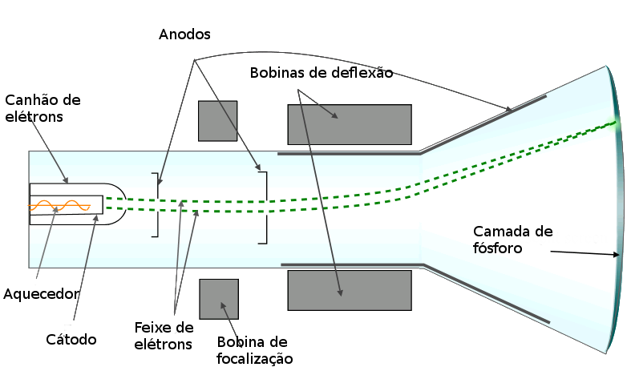
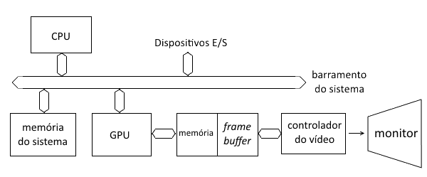
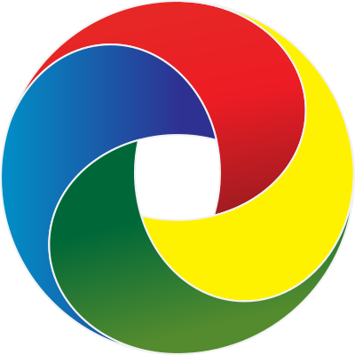
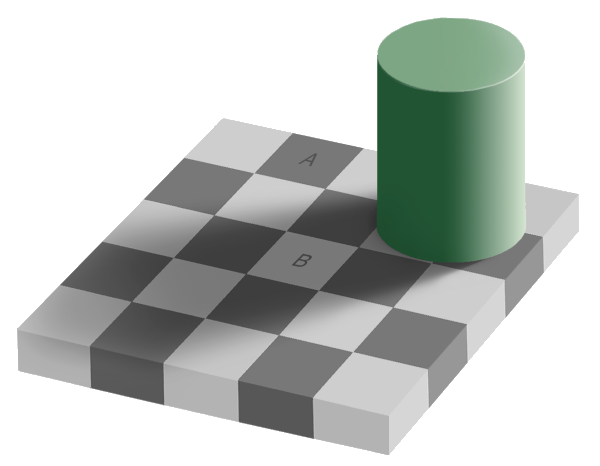
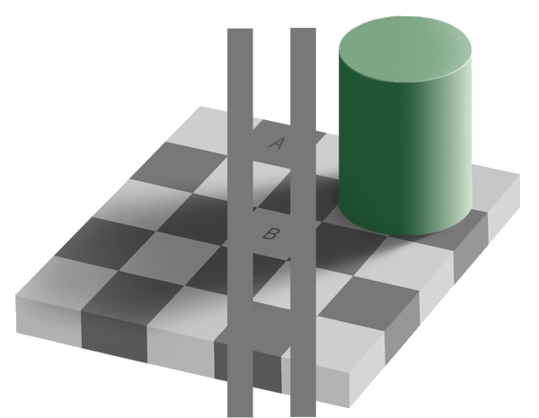
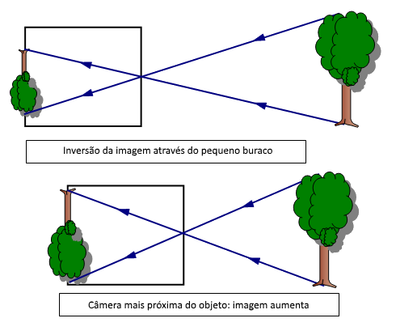
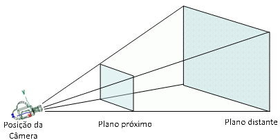
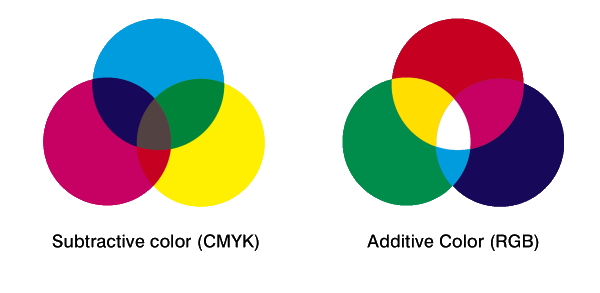

# Introdução à Computação Gráfica

---
# Roteiro

1. Conceitos
1. Dispositivos Gráficos
1. Representação de Imagens
1. Modelos usados em Computação Gráfica

---
# Alguns conceitos

---
## Computação Gráfica

**s.f.** conjunto de algoritmos, técnicas e metodologias para o tratamento
e a representação gráfica de informações através da criação, armazenamento e
manipulação de desenhos por meio de computadores e periféricos gráficos.

---
## Áreas de aplicação

1. Jogos
1. Filmes e TV
1. CAD (_Computer Aided Design_)
1. Educação e Treinamento
1. Arte por Computador
1. Apresentações Gráficas
1. Simulação Científica

---
## 1. Jogos \o/

---
## 2. Filmes, TV

---
## 2. Filmes, TV

---
## 3. CAD (_Computer Aided Design_)

---
## 4. Educação e Treinamento

---
## 5. Arte por Computador

---
## 6. Apresentações Gráficas

---
## 7. Simulações Científicas

---
## Interação com outras áreas

---
# Problemas abordados em Computação Gráfica

---
## Problemas

---
## Processamento Digital de Imagens

- Área que envolve as técnicas de transformação de imagens, em que tanto a imagem original 
  quanto a imagem resultado apresentam-se sob uma representação visual (geralmente matricial).
– Estas transformações visam melhorar as características visuais da imagem. Ex.:
  - aumentar contraste 
  - alterar foco
  - diminuir ruídos e algumas distorções

---
## Exemplo: Processamento Digital de Imagens

---
## Análise de Imagens

- Área que procura obter a especificação dos componentes de uma imagem a partir de sua representação visual.
– Por exemplo, reconstrução de primitivas elementares (cubos, esferas, etc.) que aproximam um objeto visualizado em uma imagem

---
## Exemplo: Análise de Imagens

---
## Exemplo 2: Análise de Imagens

---
## Modelagem

- A modelagem geométrica consiste de um conjunto de métodos que visam descrever a forma e as 
  características geométricas de um objeto. Ela provê uma descrição ou modelo muito mais analítico, 
  matemático e abstrato que o real.
  
---
## Exemplo: Modelagem 

---
## Síntese

- A síntese de imagem designa o processo de geração de imagens digitais a partir da descrição dos elementos que 
  compõem uma cena 3D, baseando-se em modelos que descrevem o comportamento da luz
– Síntese e modelagem são consideradas, por muitos autores, como a própria Computação Gráfica.

---
## Exemplo: Síntese

---
## Foco deste curso

- Modelagem e síntese de imagens
  - Processamento de imagens é uma área por si só
  - Visão computacional estuda a análise de imagens (e vídeos)
- Teoria e prática das técnicas e algoritmos envolvidos

---
## Professor, mas eu quero fazer desenhos em 3D

- Você pode e mesmo terá a oportunidade no nosso projeto final
- Contudo, o foco do curso está em conhecer e entender como funcionam as
  ferramentas utilizadas na criação de imagens e animações 3D
- Algumas ferramentas 3D:
  - [3ds Max](3ds-max) (licença de estudante gratuita)
  - [Maya lt](maya-lt) (licença de estudante gratuita)
  - [blender](blender) (gratuito)
  - [ZBrush](z-brush) (comercial)
  - [clara.io](claraio) (tem uma versão gratuita, programa limitado)

---
# Dispositivos Gráficos

---
## Interfaces Gráficas

- Interfaces baseadas em texto (~1980)
- Interface WIMP: Windows, Icons, Menus and Pointers
  - 

---
## Dispositivos Gráficos

- Monitores Raster
  - CRT
  - LCD
  - Plasma
- Monitores vetoriais (1963)
  - Imagens desenhadas como uma caneta
- Impressoras

---
## _Cathode Ray Tube_ (CRT)

- Tubo de raio catódico
- Baixo custo de produção
- Bom ângulo de visão

---
## Outros monitores

- Liquid Cristal Display (LCD)
  - Cada pixel são três (rgb) "orifícios" que permitem passagem de luz branca
  - Demonstração: [Desmontando um monitor de LCD (Enginner Guy)](lcd-teardown)
- Plasma
  - Composto por um grande número de lâmpadas de neon
  - Cada pixel tem uma célula de fósforo que é incandencida por raios violeta
    emitidos pelo plasma
  - Cada pixel tem 3 (rgb) subpixels

---
# Arquitetura de sistema gráfico raster

---
## Modelo **Simples**

---
## Modelo **Moderno**

---
# Representação de Imagens

Imagens podem ser representadas em duas formas principais:

- Vetoriais
  - Formulados por modelos geométricos
  - Ocupam menos espaço de armazenamento
  - Não perdem qualidade quando ampliados
  - Extensões: [**svg, cdr**]
- Raster (matricial ou matriz de pixels)
  - Matriz de pixels (_picture elements_)
  - Muito simples de gerar
  - Extensões: [**gif, jpg, png, bmp**]

---
## Imagem vetorial

---
## Imagem raster

---
# Modelos usados em Computação Gráfica
---
## O olho humano

---
## Modelo do olho humano

- Fótons (raios de luz) entram pela pupila de forma reta até atingirem a retina
- A imagem é formada pela contribuição da luz nos cones da retina
- Quanto mais próximo ao centro da retina, maior o nível de detalhes que
  percebemos
- Este modelo é complexo demais para a Computação Gráfica...

---
## Qual é mais escuro? A ou B?

---
## Resposta

---
## A Câmera _"pinhole"_ (estenopeica)

---
## A Câmera _"pinhole"_

- Versão mais simples de um modelo de visão
- Imagens mais próximas são retratadas maiores
- Modelo bastante semelhante ao que usamos

---
## O _View Frustum_

- A câmera é colocada na ponta da pirâmide
- Frustum: tronco de pirâmide formado pelo plano próximo e plano distante
- Apenas o que está dentro deles é renderizado

---
## Representação de Cores

---
## Representação de Cores

- Depende da natureza do dispositivo gráfico: aditivo (monitores) ou subtrativo
  (impressoras)
- Monitores: 24-bit RGB
  - 8 bits para vermelho (0 a 255)
  - 8 bits para verde
  - 8 bits para azul
  - Exemplo:   (255, 213, 213) ou (1, 0.84, 0.84)

---
# Referências

- [Programa de modelagem 3D blender](blender)
- [Aplicativo Web de modelagem 3D clara.io](claraio)
- [Programa de modelagem 3D Autodesk 3ds Max](3ds-max)
- [Programa de modelagem 3D Autodesk Maya](maya-lt)
- [Programa de modelagem 3D ZBrush](z-brush)
- [Desmontando um monitor de LCD (Enginner Guy)][lcd-teardown]

[blender]: http://www.blender.org/
[claraio]: https://clara.io/
[3ds-max]: http://www.autodesk.com/education/free-software/3ds-max
[maya-lt]: http://www.autodesk.com/education/free-software/maya-lt
[z-brush]: http://pixologic.com/
[lcd-teardown]: http://www.engineerguy.com/videos/video-lcd.htm
