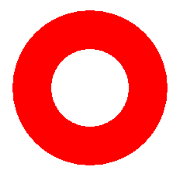
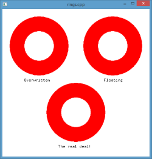

# Introdução a OpenGL **_hands on_** - Parte 2

---
# Roteiro

1. **Tipos** de dados
1. **Re**-desenhando a tela
1. Criando uma pequena **animação**
1. Escrevendo **texto**
1. Ordem de desenho (**_depth buffer_** e coordenada Z)

---
# **Tipos de Dados** em OpenGL

---
## Tipos em C

- A linguagem C possui diversos tipos de dados primitivos
  ```c
  int numCarros = 10;
  float pesoEmKg = 895.532f;
  double terraParaSol = 1.49597870700e11;
  long int numeroDeCliquesNosSlides = 20040402040l;
  ```
- Esses tipos diferentes usam **quantidades diferentes de espaço (bits)**
  da memória
  - Um `short int`, **normalmente** usa 16 bits
  - Um `int`, 32 bits
  - Um `float`, 32 bits
  - Um `double`, 64 bits

---
## Tipos em OpenGL

- Contudo, compiladores (e plataformas) diferentes **podem** usar uma
  **quantidade de bits diferente** do tradicional
  - Por exemplo, o console Nintendo possuía apenas 8 bits
- O OpenGL, com seu objetivo de executar em plataformas variadas, sugere
  o uso de seus próprios tipos de dados
  - Exemplo: `GLint` em vez de `int`
- Assim, **garante-se a precisão necessária** (_e.g._, 32 bits) em cada
  tipo de dados, em vez de deixar o compilador da plataforma decidir
- A seguir, veja o **mapeamento** dos tipos primitivos em **C para os
  tipos sugeridos pelo OpenGL**

---
## Tabela de tipos do OpenGL

| Tipo em C                       | Descrição do tipo         | Tipo do OpenGL                | Sufixo |
|---------------------------------|---------------------------|-------------------------------|:------:|
| `signed char`                   | 8-bit inteiro             | `GLbyte`                      | b      |
| `short`                         | 16-bit inteiro            | `GLshort`                     | s      |
| `int` ou `long`                 | 32-bit inteiro            | `GLint, GLsizei`              | i      |
| `float`                         | 32-bit ponto flutuante    | `GLfloat, GLclampf`           | f      |
| `double`                        | 64-bit ponto flutuante    | `GLdouble, GLclampd`          | d      |
| `unsigned char`                 | 8-bit inteiro sem sinal   | `GLubyte, GLboolean`          | ub     |
| `unsigned short`                | 16-bit inteiro sem sinal  | `GLushort`                    | us     |
| `unsigned int or unsigned long` | 32-bit inteiro sem sinal  | `GLuint, GLenum, GLbitfield`  | ui     |

---
# **Re**-desenhando a Tela

---
## O Problema

- Mesmo quando altera-se alguma característica da cena via código, a janela continua da mesma forma, _e.g._:
  ```c
  glPolygonMode(GL_FRONT_AND_BACK, GL_LINES);
  ```
  - Precisamos redesenhar a tela... mas como?
    - Chamar `desenhaMinhaCena()` diretamente?
      - Não devemos!
  - Quem manda desenhar é o Freeglut (sistema de janelas), por meio do **evento _"display"_**
    - Então, **basta avisar ao Freeglut** que, assim que possível, ele deve mandar **disparar um <u>evento _display_</u>**

---
## A Solução (neste caso)

- Para avisar ao Freeglut que a janela deve ser redesenhada, usamos o comando `glutPostRedisplay()`:
  ```c
  void teclaPressionada(unsigned int key, int x, int y) {
    // ...
    glutPostRedisplay();
  }
  ```
- Para uma animação, precisamos redesenhar várias vezes por segundo
  - Tipicamente chamamos `glutPostRedisplay()` várias vezes/segundo

---
# Criando uma pequena animação

---
## Animando uma Cor

<video width="413" height="430"  poster="../../images/animacao-cor-video-preview.png" controls loop>
  <source src="../../videos/animacao-cor.mp4" type="video/mp4" />
</video>

[Exemplo: Animação de cor](codeblocks:animacao-cor/CodeBlocks/animacao-cor.cbp)

---
## glutTimerFunc(msecs, func, value)

- Podemos registrar uma _callback_ para **ser invocada daí a `x` ms**.
- Podemos usá-la p/ alterar parâmetros (cor, posição etc.) da cena
  ```c
    void atualizaCena(int valor)
    {
      // altera a cor do quadrado
      ...
      // atualiza a tela (desenha() será invocada novamente)
      glutPostRedisplay();
      // registra a callback novamente
      // por quê 25? 1000/25 = 40fps
      glutTimerFunc(25, atualizaCena, 0);
    }
    glutTimerFunc(0, atualizaCena, 0); // lá no int main()
  ```

---
## Experimento

1. Criar um quadrado que muda de cor
   ```c
   void timerColored(int valor) {
     color += colorIncrement;
     if (color > 1) {         // maior que
       color = 1; colorIncrement = colorIncrement * -1;
     } else if (color < 0) {  // menor que
       color = 0; colorIncrement = colorIncrement * -1;
     }
     glutPostRedisplay();
     glutTimerFunc(25, timerColored, 0);
   }
   ```

---
## Usando **2 _Buffers_**

- Quando estamos criando uma animação - **atualizando a tela várias
  vezes por segundo**, podemos um problema de **"imagens" estateladas** (_flickering_)
- Isso acontece porque estamos escrevendo no COLOR_BUFFER ao mesmo tempo que
  ele é enviado ao monitor
- Para evitar, usamos um _**double buffer**_:
  1. _front-buffer_: é quem está sendo mostrado pelo monitor
  1. _back-buffer_: é onde estamos "pintando" o próximo quadro
- Após terminar de desenhar no _back buffer_, invertemos quem é _front_ com o _back_

---
## Usando **2 _Buffers_** com Freeglut

1. Configuramos o Freeglut com **`GLUT_DOUBLE`** <u>em vez de</u> `GLUT_SINGLE`:
  ```c
  int main(int argc, char** argv) {
      glutInitDisplayMode(GLUT_RGB | GLUT_DOUBLE);
      // ...
  }
  ```
  - Mas o que significa o símbolo `|`?
1. Na _callback_ de _display_, **`glutSwapBuffers();`** <u>em vez
  de</u> `glFlush();`:
  ```c
  void desenha() {
      // ...
      glutSwapBuffers();
  }
  ```

---
## Outra animação: **segue o mouse**

- [Exemplo de quadrado seguindo o mouse](codeblocks:animacao-segue-mouse/CodeBlocks/animacao-segue-mouse.cbp)

---
# Escrevendo Texto

---
## Gráficos _raster_

- Até agora, vimos como desenhar primitivas geométricas em OpenGL
  - `GL_TRIANGLE_FAN`, `GL_TRIANGLE_STRIP` etc.
- Contudo, queremos também **desenhar áreas retangulares de cores**
  - Exemplos:
    1. Colocar imagens na tela
    1. Escrever texto
- Veremos duas formas para escrever texto na tela
  1. OpenGL puro
  1. GLUT _to the rescue_ \o/

---
## **_Bitmaps_ e fontes** (OpenGL puro)

- O OpenGL provê primitivas de nível baixo para a escrita de caracteres na tela
- 
  Os comandos `glRasterPos*()` e `glBitmap()` posicionam e desenham um _bitmap_
- Pode-se usar _display lists_ (próxima aula) para armazenar o _bitmap_ de cada letra e apenas
  usá-lo por seu índice posteriormente
- O restante é com a gente =)
  - [Exemplo de desenho de texto **em OpenGL "puro"**](codeblocks:fontes-opengl-f/CodeBlocks/fontes-opengl-f.cbp)

---
## **Exemplo** de texto na tela em OpenGL puro

```c
GLubyte rasters[24] = {
   0xc0, 0x00, 0xc0, 0x00, 0xc0, 0x00, 0xc0, 0x00, 0xc0, 0x00,
   0xff, 0x00, 0xff, 0x00, 0xc0, 0x00, 0xc0, 0x00, 0xc0, 0x00,
   0xff, 0xc0, 0xff, 0xc0};

void init(void)
{
   glPixelStorei (GL_UNPACK_ALIGNMENT, 1);
   glClearColor (0.0, 0.0, 0.0, 0.0);
}

void display(void)
{
   glClear(GL_COLOR_BUFFER_BIT);
   glColor3f (1.0, 1.0, 1.0);
   glRasterPos2i (20, 20);
   glBitmap (10, 12, 0.0, 0.0, 11.0, 0.0, rasters);
   glBitmap (10, 12, 0.0, 0.0, 11.0, 0.0, rasters);
   glBitmap (10, 12, 0.0, 0.0, 11.0, 0.0, rasters);
   glFlush();
}
```

---
## [glBitmap](https://www.khronos.org/registry/OpenGL-Refpages/gl2.1/xhtml/glBitmap.xml)

```c
void glBitmap(
  GLsizei width,
  GLsizei height,
  GLfloat xorig,
  GLfloat yorig,
  GLfloat xmove,
  GLfloat ymove,
  const GLubyte* bitmap);
```

## [glRasterPosi](https://www.khronos.org/registry/OpenGL-Refpages/gl2.1/xhtml/glRasterPos.xml)

```c
void glRasterPos2i(GLint x, GLint y);
```

---
## **_Bitmaps_ e fontes** (usando GLUT)

- GLUT já implementou algumas fontes (usando `glBitmap()`) e nos oferece **algumas
  opções mais simples**
- Documentação da função [glutBitmapCharacter](http://freeglut.sourceforge.net/docs/api.php#FontRendering)
  ```c
  void glutBitmapCharacter(void* font, int character);
  ```
  - Algumas opções para o parâmetro `font`:
    ```c
    GLUT_BITMAP_8_BY_13
    GLUT_BITMAP_9_BY_15
    GLUT_BITMAP_TIMES_ROMAN_10
    GLUT_BITMAP_HELVETICA_18
    ```

---
## **Exemplo** de texto na tela em GLUT

```c
void texto(void* font, char* s, float x, float y) {
  unsigned int i;
  glRasterPos2f(x, y);

  for (i = 0; i < strlen (s); i++) {// menor que
     glutBitmapCharacter(font, s[i]);
  }
}

void display() {
  glClear(GL_COLOR_BUFFER_BIT);
  glColor3f (1.0, 1.0, 1.0);
  texto(GLUT_BITMAP_HELVETICA_18, "FFF", 20, 20);
  glFlush();
}

```
- [Exemplo de texto usando GLUT](codeblocks:fontes-glut/CodeBlocks/fontes-glut.cbp)
- [Mesmo exemplo, em OpenGL puro](codeblocks:fontes-opengl/CodeBlocks/fontes-opengl.cbp)

---
# Ordem de Desenho

---
## Atividade

- Desenhar um anel vermelho



---
## **Três** formas

1. Desenha um círculo vermelho grande, depois um branco pequeno
1. Igual anterior, mas coloca o branco mais próximo da tela
1. Desenha um círculo furado

---
## Função: desenhaDisco(R, x, y, z)

```c
void desenhaDisco(float raio, float x, float y, float z) {
  float t;
  int i;

  glBegin(GL_TRIANGLE_FAN);
    glVertex3f(x, y, z);
      for(i = 0; i <= NUM_LADOS; ++i) {//menor ou igual
        t = 2 * M_PI * i / NUM_LADOS;
        glVertex3f(x + cos(t) * raio, y + sin(t) * raio, z);
      }
  glEnd();
}
```

- [Exemplo do Disco](codeblocks:discos/CodeBlocks/discos.cbp)

---
## Experimento

- E se alterarmos a ordem do branco com o vermelho?

---
## O que aconteceu?

- Por padrão, o OpenGL usa o **algoritmo do pintor** para a **determinação da
  visibilidade** dos polígonos

  
  - O que é desenhado por último aparece na frente
  - O OpenGL simplesmente desenha os triângulos, na ordem que pedimos

---
## **Teste de profundidade**

- Para que ele faça um teste da coordenada `Z`, (1) <u>precisamos ativar
  o **teste de profundidade**</u>
  - ```c
    glEnable(GL_DEPTH_TEST);
    // desenha
    glDisable(GL_DEPTH_TEST);
    ```
- Também precisamos (2) <u>limpar o _depth buffer_</u>, da mesma forma que
  limpamos a cor da janela
  ```c
  glClear(GL_COLOR_BUFFER_BIT | GL_DEPTH_BUFFER_BIT);
  ```
- E (3) <u>avisar a freeglut</u> que vamos usar o _depth buffer_
  ```c
  glutInitDisplayMode(GLUT_DOUBLE | GLUT_RGB | GLUT_DEPTH);
  ```


---
## O _depth buffer_ (ou **z-buffer**)


---
## Experimento

- Alterar o código para usar o _depth buffer_
- O segundo anel é desenhado de forma correta independente da ordem de desenho

  

---
# Referências

- Capítulo 4 do livro **Computer Graphics with OpenGL 4th edition**
- Documentação do OpenGL 2: https://www.opengl.org/sdk/docs/man2/
- Livro Vermelho: http://www.glprogramming.com/red/ (capítulo 8)
