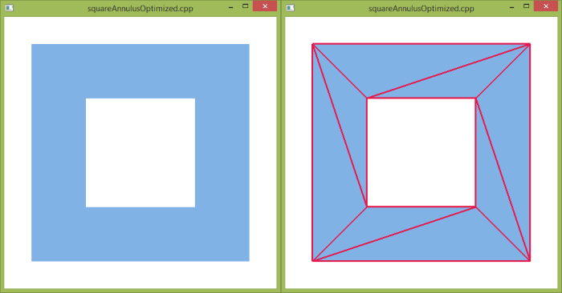
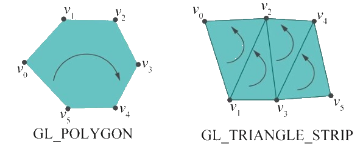

# Introdução a OpenGL **_hands on_** - Parte 3

---
# Roteiro

1. Display Lists
1. Orientação dos Polígonos
1. Usando Texturas
1. **Trabalho Prático 1**

---
# Display Lists

---
## Exercício 2 da lista



- E se quisermos desenhar o polígono E as linhas ao mesmo tempo?

---
## Tentativa 1

- Desenha-se o polígono preenchido:
  ```c
  glPolygonMode(GL_FRONT_AND_BACK, GL_FILL);
  glBegin(GL_TRIANGLE_STRIP);
    // 10 vértices aqui...
  glEnd();
  ```
- Em seguida, desenha-se o polígono em modo _wire_:
  ```c
  glPolygonMode(GL_FRONT_AND_BACK, GL_LINES);
  glBegin(GL_TRIANGLE_STRIP);
    // os mesmos 10 vértices aqui...
  glEnd();
  ```

---
## Tentativa 1 - discussão

- Temos um **_code smell_** - algo está errado
- **Não devemos repetir código** para que não precisemos alterar mais de um
  lugar caso precisemos no futuro
  - Princípio DRY - _Don't Repeat Yourself_
- Podemos resolver isso extraindo o código repetido para uma função...
  - Esse processo se chama **refatorar o código**

---
## Tentativa 2: Criamos uma função: `desenhaAnelQuadrado()`
  ```c
  void desenhaAnelQuadrado() {
    glBegin(GL_TRIANGLE_STRIP);
      // 10 vértices aqui...
    glEnd();
  }
  //...

  void desenhaCena() {
    glColor3f(1.0, 0, 0);     // azul
    glPolygonMode(GL_FRONT_AND_BACK, GL_FILL);
    desenhaAnelQuadrado();

    glColor3f(1.0, 0, 0);     // preto
    glPolygonMode(GL_FRONT_AND_BACK, GL_LINES);
    desenhaAnelQuadrado();
  }
  ```

---
## Tentativa 2 - discussão

- Resolvemos o _code smell_, mas não paramos por aí
- Se, em vez de 10 vértices, nosso polígono tivesse 1 mil vértices?
  - Cada chamada a `glVertex` faz **uma viagem da CPU à GPU**
    - Em outras palavras, é uma **_draw call_**
- O OpenGL pode **registrar um polígono** caso queiramos desenhá-lo
  várias vezes

---
## Tentativa 3 - usando **lista de visualização**

- Em vez de chamar o método de desenho na _callback_ de desenho, vamos registar
  os vértices **em tempo de inicialização do programa** e apenas instruir o
  OpenGL a executar esses vértices em tempo de desenho
- Assim, otimizamos bem as chamadas de desenho de vértices

---
<!--
  classes: two-column-code
-->

## Tentativa 3 (1/2)

```c
int listaAnel;
void criaListaAnelQuadrado() {
  listaAnel = glGenLists(1);
  glNewList(listaAnel,
    GL_COMPILE);
    glBegin(GL_TRIANGLE_STRIP);
      // os 10 vértices
    glEnd();
  glEndList();
}


int main(int c, char** v) {
  glutInit(argc, argv);
  //...
  criaListaAnelQuadrado();
  //...
  glutMainLoop();
}
```

---
## Tentativa 3 (2/2)

```c
void desenhaCena() {
  glColor3f(1.0, 0, 0);     // azul
  glPolygonMode(GL_FRONT_AND_BACK, GL_FILL);
  glCallList(listaAnel);    // chama lista

  glColor3f(1.0, 0, 0);     // preto
  glPolygonMode(GL_FRONT_AND_BACK, GL_LINES);
  glCallList(listaAnel);    // chama lista
}
```

---
# Orientação de Polígonos

---
## Orientação

- Todo polígono convexo possui um lado de fora e um lado de dentro
  - Ou lado da frente e lado de trás
- Em computação gráfica, é importante saber qual é o lado do polígono que
  estamos vendo por:
  - **Desempenho**: muitas vezes desenhamos só o lado de fora/frente
  - **Flexibilidade**: alguns polígonos podem precisar ser desenhados
    diferentemente se o estamos pela frente ou por trás
- Em OpenGL, definimos a orientação dos polígonos de forma implícita...

---
## Orientação no OpenGL

- O lado de fora/frente de um polígono em OpenGL é dado **<u>pela ordem</u>
  em que declaramos seus vértices**

  

---
## Exemplo de Orientação

```c
void desenhaMinhaCena()
{
    //...
    glPolygonMode(GL_BACK, GL_FILL);  // Lado de trás: preenchido
    glPolygonMode(GL_FRONT, GL_LINE); // Da frente: contorno

    // Desenha um polígono por seus vértices
    glBegin(GL_TRIANGLE_FAN);
        glVertex3f(20.0, 20.0, 0.0);
        glVertex3f(80.0, 20.0, 0.0);
        glVertex3f(80.0, 80.0, 0.0);
        glVertex3f(20.0, 80.0, 0.0);
    glEnd();
    //...
}
```
- [Exemplo de Orientação](codeblocks:orientacao-poligono/CodeBlocks/orientacao-poligono.cbp)

---
# Posicionamento

---
## Posicionando Objetos - O Jeito Ruim

- A forma como temos posicionado objetos não é legal:
  ```c
  glBegin(GL_TRIANGLE_FAN);
      glVertex2f(per.x,             per.y);
      glVertex2f(per.x + per.larg,  per.y);
      glVertex2f(per.x + per.larg,  per.y + per.alt);
      glVertex2f(per.x,             per.y + per.alt);
  glEnd();
  ```
  - Problema: e se houver muito mais do que 4 vértices?
  - Questão: não seria bem mais fácil definir as coordenadas se **pudéssemos
    assumir que estamos <u>sempre na origem</u>?**

---
## Posicionando Objetos - Do Jeito Top

- Damos as coordenadas assumindo que estamos na origem, mas transladamos
  o objeto para onde queremos que ele realmente seja desenhado:
  ```c
  glPushMatrix();                 // Importante!!
      glTranslatef(per.x, per.y, 0);
      glBegin(GL_TRIANGLE_FAN);
          glVertex2f(0,         0);
          glVertex2f(per.larg,  0);
          glVertex2f(per.larg,  per.alt);
          glVertex2f(0,         per.alt);
      glEnd();
  glPopMatrix();                  // Importante!!
  ```

---
# Usando Texturas

---
## Texturas

- Teremos uma aula sobre o tópico texturas mais a frente
- Contudo, vamos começar a aprender para já ir usando
- As funções básicas são:
  - `glEnable(GL_TEXTURE_2D);`, para **habilitar texturas**
  - `glBindTexture(GL_TEXTURE_2D, int)`, para **começar a usar** uma textura
  - `glTexCoord2f(x, y)`, para definir **coordenada de textura para cada vértice**
- Vamos ver um exemplo...
  - [Textura simples usando SOIL](codeblocks:textura-simples-soil/CodeBlocks/textura-simples-soil.cbp)

---
## Variável global

- Temos uma variável global que armazenará um **identificador de textura**, que é
  um número inteiro que será gerado pelo OpenGL
  ```c
  GLuint texturaDoMario;
  ```
  - Pense nesta variável como guardando o **número da gavetinha** onde o OpenGL
    reservou espaço para a **matriz de cores da imagem**

---
## Na _callback_ de desenho

```c
void desenhaMinhaCena() {
  //...
  glEnable(GL_TEXTURE_2D);
  glBindTexture(GL_TEXTURE_2D, texturaDoMario);
  glBegin(GL_QUADS);
    glTexCoord2f(0, 0); glVertex3f(-1, -1,  0);
    glTexCoord2f(1, 0); glVertex3f( 1, -1,  0);
    glTexCoord2f(1, 1); glVertex3f( 1,  1,  0);
    glTexCoord2f(0, 1); glVertex3f(-1,  1,  0);
  glEnd();
  glDisable(GL_TEXTURE_2D);
  //...
}
```

---
## Explicando o uso das funções

- Ao desenhar o polígono que queremos texturizar, devemos seguir **3 passos**:
  1. **Habilitar** o uso de texturas bidimensionais
  1. **Especificar qual textura vamos aplicar** ao próximo polígono a ser desenhado
  1. **Mapear** cada canto da textura a cada vértice do polígono
- Agora, falta saber como carregar uma imagem no OpenGL para servir de textura

---
## Carregando texturas

- O OpenGL não possui funções para carregar texturas
- Basicamente, precisamos abrir o arquivo de imagem nós mesmos (`fopen` e amigos) e
  usar outros 4-5 métodos do OpenGL para então conseguirmos usar um arquivo como
  textura:
  - `glGenTextures(...), glTexParameteri(..), glTexImage2D(...), glTexEnvf(...)`
- Veremos como esses métodos funcionam em aulas futuras, mas hoje vamos usar
  uma **biblioteca chamada SOIL** que possui funções para carregar arquivos de imagem
  diretamente

---
## <abbr title="Simple OpenGL Image Library">SOIL</abbr>

- Biblioteca para carregar arquivos de imagem no formato esperado pelo OpenGL
- Suporta diversos formatos de imagem:
  - png
  - jpg
  - bmp etc.
- Para baixar e ler a documentação: http://lonesock.net/soil.html

---
## Em alguma função de inicialização

```c
GLuint texturaDoMario;    // id da textura

void init() {
  texturaDoMario = SOIL_load_OGL_texture(
    "mario.png",
    SOIL_LOAD_AUTO,
    SOIL_CREATE_NEW_ID,
    SOIL_FLAG_INVERT_Y
  );

  if (texturaDoMario == 0 ) {
    printf("Erro carregando textura: '%s'\n", SOIL_last_result());
  }
}
```

---
# Trabalho Prático 1 \o/

_A wild TP1 appears..._

---
## TP1: **GORILLAS.BAS**


  _"A ideia básica é lançar ~~bananas explosivas~~
  projéteis nos ~~gorilas~~ adversários para ~~explodi-los~~ explodi-los."_

- Enunciado no Moodle (ou [na página do curso](https://github.com/fegemo/cefet-cg/blob/master/assignments/tp1-gorillas/README.md)).

---
# Referências

- Documentação do OpenGL 2: https://www.opengl.org/sdk/docs/man2/
- Livro Vermelho: http://www.glprogramming.com/red/
