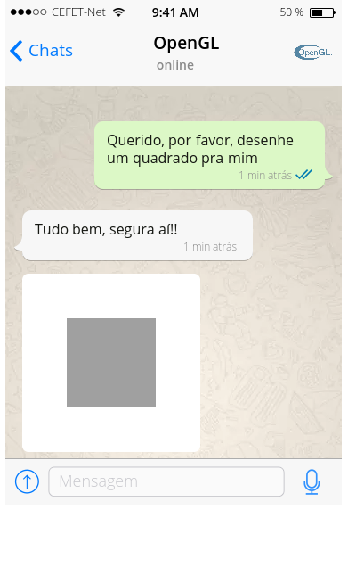
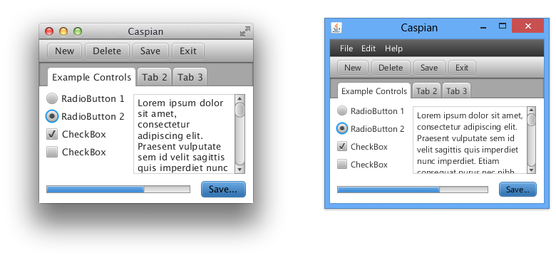
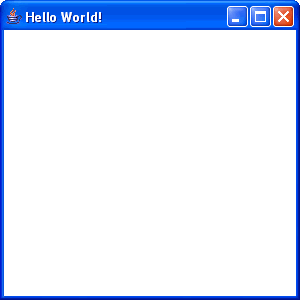
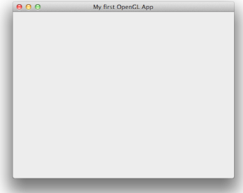

# OpenGL, Sistemas de Janelas e GLUT

---
# Roteiro

1. _Hello World_
1. Conceitos
1. Sistemas de janelas
1. Criando um projeto OpenGL
1. ~~GLUT~~ Freeglut
1. TP0

---
# _Hello World_

---
Apenas uma janela preta com um quadrado verde :)

```c
#include "GL/glew.h"  // use sinal maior,menor
#include "GL/freeglut.h" // aqui também

void desenharMinhaCena(void)
{
    glClearColor(1.0, 1.0, 1.0, 1.0);
    glClear(GL_COLOR_BUFFER_BIT);
    glColor3f(0.0, 1.0, 0.0);
    glBegin(GL_POLYGON);
        glVertex3f(-0.5, -0.5, 0.0);
        glVertex3f( 0.5, -0.5, 0.0);
        glVertex3f( 0.5,  0.5, 0.0);
        glVertex3f(-0.5,  0.5, 0.0);
    glEnd();
    glFlush();
}

int main(int argc, char** argv)
{
    glutInit(&argc, argv);
    glutInitContextVersion(1, 1);
    glutInitContextProfile(GLUT_COMPATIBILITY_PROFILE);
    glutInitDisplayMode(GLUT_SINGLE);
    glutInitWindowSize(300, 300);
    glutInitWindowPosition(100, 100);
    glutCreateWindow("Quadrado");
    glutDisplayFunc(desenharMinhaCena);
    glutMainLoop();
    return 0;
}
```

---
# Excecutando nosso _Hello World_...


---
## OpenGL

- _Open Graphics Library_ ou biblioteca gráfica aberta
- Basicamente, nos possibilita desenhar na tela
- Funciona como uma **máquina de estados**, _e.g._:
  - Existe o conceito de "cor selecionada" e tudo é desenhado com ela,
    até que se selecione outra
- É uma **API** (_Application Programming Interface_) de acesso a **recursos
  (algoritmos e mesmo _hardware_) gráficos**, que oferece rotinas para:
  - **Desenhar primitivas geométricas (polígonos)** e imagens
  - **Alterar variáveis de estado** (cor, material, fontes de luz)
  - Consultar variáveis de estado

---
## Máquina de Estados <sub>WTH?</sub>




---
## OpenGL (cont.)

- OpenGL é um padrão em evolução (atualmente, v4.5)
  - Novas versões são estabelecidas por um comitê
    (chamado <abbr title="Architecture Review Board">ARB</abbr>) de usuários e
    fabricantes
    - Tornou-se _OpenGL Working Group_ dentro do [_Khronos Group_][khronos]
      em setembro de 2006
- **OpenGL cuida apenas de gerar o "conteúdo" das janelas**
  - <u>Depende de um sistema de janelas</u>: alguém que lide com
    operações relativas a janelas:
    1. criar uma janela
    1. maximizar, minimizar
    1. lidar com o fechamento etc.

[khronos]: https://www.khronos.org/

---
# Sistemas de janelas

---
## Sistemas de janelas (**SJ**)

- Principal meio de interação homem/máquina
  - Baseado no conceito de
    <abbr title="Windows, Icons, Menus and Pointers">WIMP</abbr>
- **Tela é dividida em janelas** (eventualmente superpostas) **controladas por
  aplicações** que têm a incumbência de mantê-las sempre atualizadas
- **Cada sistema operacional tem o seu SJ** e o linux tem várias opções
  - `#include 'x.h'`
  - `#include 'QtOpenGL'`
  - `#include 'QuartzCore/QuartzCore.h'`
  - `#include 'windows.h'`, etc.
- Cada sistema de janelas possui uma <u>API distinta</u>
  - Ou seja, uma aplicação feita para `windows.h` não funciona no Linux =/

---
## Sistemas de janelas (cont.)

Utiliza o paradigma de **programação orientada a eventos** (PoE)

1. A interação é comunicada via **eventos**:
  - Mouse se movimentou (10u, 5u)
  - A tecla 'K' foi pressionada
  - Janela foi redimensionada
1. Eventos são "tratados" por rotinas _callback_
  1. Redesenhar a janela quando ela for redimensionada
  1. Mover o personagem quando a tecla <kbd>W</kbd> for pressionada

---
## Sistemas de janelas (cont.)

1. As APIs contém rotinas como
  1. **Criar janela**
  1. **Reposicionar e desenhar** janela
  1. Desenhar botões, barras, menus (**_widgets_**)
  1. **Disparar eventos** na aplicação que contenha o foco

---
## _Widgets_ no OSX e no Windows



---
## _Hello World_ OpenGL no Windows e no OSX




---
## Interação do OpenGL com os SJs

1. Um programa OpenGL
  1. é responsável apenas pelo **conteúdo da janela**
  1. pode registrar para **"escutar" eventos** disparados pelo sistema de
     janelas
  1. precisa ser incluído junto da API de um SJ

---
Como cada SJs tem uma API diferente


Como faço se eu quiser fazer um programa OpenGL que **execute em vários
sistemas operacionais**?

---
## ~~GLUT~~ Freeglut (_Free OpenGL Utilities Toolkit_)

- **API portátil** de acesso aos SJs que cria uma abstração
- **Não** é parte **oficial** do OpenGL
- Encapsula e **esconde as camadas proprietárias**

---
Hmm... Precisa de mais motivação para usar o GLUT??
Veja um _hello world_ usando GLUT e outro usando a API do SJ do Windows.

- Usando GLUT: https://gist.github.com/fegemo/ddfa33441281e564eefe
- Usando `windows.h`: https://gist.github.com/fegemo/1f534a2a59d7d289ec48

---
# Criando um projeto em OpenGL

---
## Você vai precisar de:

- Um **ambiente para desenvolvimento** em C/C++:
  - Uma IDE ou editor de texto (CodeBlocks, DevCpp etc.)
  - Um compilador (gcc, mingW, cygwin + gcc)
- As bibliotecas do **OpenGL** (já está instalada) e do **freeglut**
- A biblioteca **GLU** (_OpenGL Utilities_) que facilita algumas funções
  do OpenGL
- A biblioteca **GLEW** (_OpenGL Extension Wrangler_)

---
# Programas em OpenGL

---
## Anatomia de um programa OpenGL/GLUT

```c
#include "GL/glew.h"        // DEVE VIR ANTES DO GLUT
#include "GL/freeglut.h"    // DEPOIS DO GLEW

void desenharMinhaCena() {
  // comandos para desenhar coisas
}
void teclaPressionada(unsigned int key, int x, int y) {
  // tomar ação baseada em alguma tecla pressionada
}
// Outras callbacks

int main(int argc, char** argv) {
    // Acordando o GLUT
    glutInit(&argc, argv);

    // Definindo a versão do OpenGL que vamos usar
    glutInitContextVersion(1, 1);
    glutInitContextProfile(GLUT_COMPATIBILITY_PROFILE);

    // Configuração inicial da janela do GLUT
    glutInitDisplayMode(GLUT_SINGLE | GLUT_RGBA);
    glutInitWindowSize(400, 400);
    glutInitWindowPosition(100, 100);

    // Abre a janela
    glutCreateWindow("Quadrado");

    // Registro de callbacks de eventos
    glutDisplayFunc(desenharMinhaCena);
    glutKeyboardFunc(teclaPressionada);

    // Dá início ao loop de atualização do glut
    glutMainLoop();
    return 0;
}
```

---
## Headers OpenGL/GLUT

```c
#include "GL/freeglut.h"
```
1. O Freeglut já inclui automaticamente os _headers_ do OpenGL, então **não
  é necessário** incluir o `gl.h` e o `glu.h`:
  ```c
  #include "GL/gl.h"
  #include "GL/glu.h"
  ```
1. Se freeglut não for usado, os headers OpenGL têm que ser incluídos
  explicitamente, junto com os de sistema de janelas (_e.g._, `windows.h`)

---
## Freeglut – Registrando _Callbacks_

- _Callbacks_ são funções que serão chamadas para tratar eventos
- Para uma _callback_ ser efetivamente chamada, ela precisa ser
  registrada por meio de uma função do tipo `glut`**`{Evento}`**`Func(callback)`
  - Onde `{Evento}` designa um tipo de evento e _callback_ é o nome da função.
    Exemplos:
    - `glut`**`Keyboard`**`Func`
    - `glut`**`Mouse`**`Func` etc.
- Por exemplo, para registrar uma _callback_ de desenho chamada
  `desenharMinhaCena`, usa-se:
  ```c
  glutDisplayFunc(desenhaMinhaCena);
  ```

---
<!--
  classes: "two-column-code"
-->

## Freeglut – _Callback_ de **desenho**

- Chamada automaticamente sempre que a **janela precisa ser redesenhada**
- Tipicamente colocamos comandos do OpenGL para desenhar coisas:
  ```c
  void desenha() {
      glClear(  // mesma linha
        GL_COLOR_BUFFER_BIT);
      glBegin(GL_LINE_LOOP);
          glVertex3fv(0,  0, 0);
          glVertex3fv(0, 10, 0);
      glEnd();
      glFlush();
  }

  //... resto do programa

  int main(int c, char** v) {
      // ...
      glutDisplayFunc(desenha);
      // ...
  }
  ```

---
<!--
  classes: "two-column-code"
-->

## Freeglut – Callback de **redimensionamento**

- Chamada sempre que a **janela é redimensionada**, isto é, teve seu tamanho
  alterado
  - Além disso, chama-se 1x assim que a janela é criada
- Tem a forma
  ```c
  void redimensionada(
    int width, int height) {
    // ...
  }

  // resto do programa
  int main(int argc/*...*/) {
      // ...
      glutReshapeFunc(  // :3
        redimensionada);
      // ...
  }
  ```
  - `width`/`height` são a nova largura/altura da janela (em pixels)

---
## Freeglut - Outras _callbacks_

- Outras callbacks comumente usadas
  - Eventos de teclado - `glutKeyboardFunc(callback)`:
  ```c
  void teclaPressionada(unsigned char key, int x, int y) {}
  ```
  - Eventos de _mouse_:
  ```c
  void mouse (int button, int state, int x, int y) {  }
  void motion (int x, int y) { /*...*/ }
  void passiveMotion (int x, int y) { /*...*/ }
  ```

---
## Freeglut - Outras _callbacks_ (cont.)

- Evento "tô atoa" - `glutIdleFunc(atoa)`:
  ```c
  void atoa() { /*...*/ }
  ```
  Chamada continuamente quando nenhum outro evento ocorre
- Evento _"timer"_ - `glutTimerFunc(alarme, 500)`:
  ```c
  void alarme(int numero) { /*...*/ }
  ```
- Questionário Maroto: [Eventos e Callbacks do Freeglut](https://moodle.cefetmg.br/mod/quiz/view.php?id=17737)

---
## Programa OpenGL/Freeglut - Inicialização

Inicialização do Freeglut
```c
glutInit(int* argc, char** argv);
```
Estabelece contato com sistema de janelas
Opções de linha de comando são processadas e removidas

---
## Programa OpenGL/Freeglut - Inicialização (cont.)

- Inicialização da janela:
  ```c
  glutInitDisplayMode(int modoDeOperacao);
  ```
  Estabelece o tipo de recursos necessários para as janelas que serão
criadas. Modo é um "ou" bit-a-bit de constantes:
    - `GLUT_RGB` cores dos pixels serão expressos em RGB
    - `GLUT_DOUBLE` bufferização dupla (ao invés de simples)
    - `GLUT_DEPTH` buffer de profundidade (z-buffer)
    - `GLUT_ACCUM` buffer de acumulação
    - `GLUT_ALPHA` buffer de cores terá componente alfa

---
## Programa OpenGL/Freeglut - Inicialização (cont.)

- Posicionamento da janela
  ```c
  glutInitWindowPosition(int x, int y);
  ```
  Estabelece a posição inicial do canto superior esquerdo da janela a ser criada
- Tamanho da janela
  ```c
  glutInitWindowSize(int largura, altura);
  ```
  Estabelece o tamanho (em pixels) da janela a ser criada

---
## Programa OpenGL/Freeglut - Inicialização (cont.)

- Criação da(s) janela(s)
  ```c
  int glutCreateWindow(char* tituloDaJanela);
  ```
  - Cria uma nova janela primária (top-level)
  - Nome é tipicamente usado para rotular a janela
  - O número inteiro retornado é usado pelo GLUT para identificar a janela
- Outras inicializações
  - Após a criação da janela é costumeiro configurar variáveis de estado do
    OpenGL que não mudarão no decorrer do programa. Por exemplo:
    - Cor do fundo
    - Tipo de sombreamento de desejado

---
## Programa OpenGL/Freeglut – Laço Principal

- Depois de registradas as _callbacks_, o controle é entregue ao sistema de
  janelas:
  ```c
  glutMainLoop();
  ```
- Esta rotina na verdade é o "despachante" de eventos
- Ela nunca retorna

---
# Para casa: TP0

---
## TP0: Instalação do OpenGL


- [Especificação do TP0](https://github.com/fegemo/cefet-cg/tree/master/assignments/tp0/README.md)
- Atividade A (valor: 1 ponto):
  1. Para a próxima aula, você deve configurar um ambiente de
    desenvolvimento em OpenGL na sua casa
    - Basicamente, você precisa instalar o Freeglut
  1. Escreva um programa `hello world` em OpenGL e Freeglut cujo **título da
    janela é seu nome completo**
    - Sua cena deve conter apenas um quadrado, como no exemplo desta aula
  1. **No Moodle**, poste uma _screenshot_ da sua janela na tarefa do TP0

---
## TP0: Instalação do OpenGL

- Atividade B (valor: até 1 ponto **extra**):
  - Opcionalmente, você pode escrever um guia passo a passo sobre
    como configurar o OpenGL usando suas ferramentas favoritas
  - Os passos **DEVEM** ser reprodutíveis e funcionar para que se consiga os pontos
  - Enviar via Sistema de [Tutoriais OpenGL][sistema-tutoriais] da disciplina

[sistema-tutoriais]: http://opengl-tutorials.herokuapp.com/
