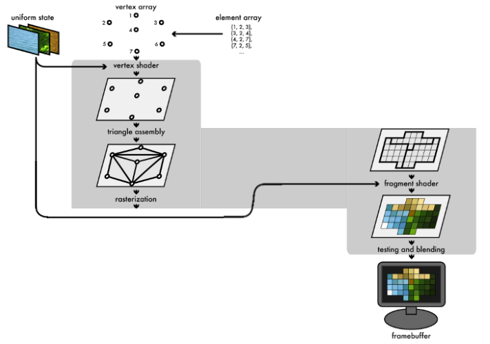
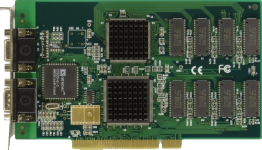
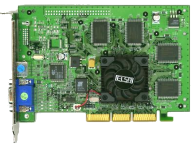
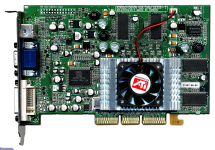
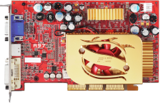
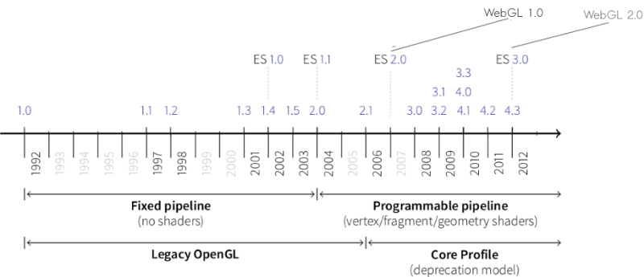
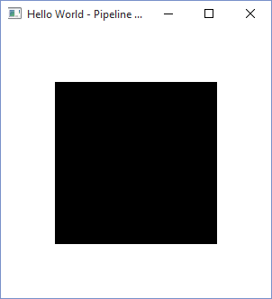
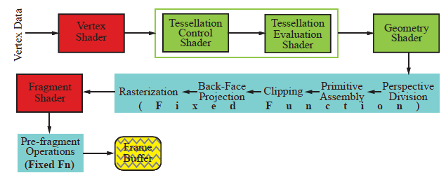
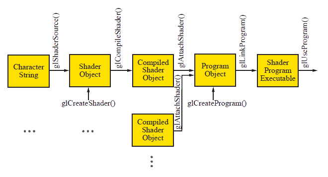

# Pipeline Programável

---
<!--
backdrop: ninokuni
-->

# Nem sempre **_Gouraud/Phong_** respondem tudo...

---
## Roteiro

1. Evolução do _hardware_ gráfico
1. OpenGL Moderno
1. GLSL: OpenGL _Shading Language_

---
## O pipeline gráfico


---

---
# Evolução do _hardware_ gráfico

---
## Geração I: 3dfx Voodoo (**1996**)

- 
  Uma das primeiras placas gráficas com aceleração para operações 3D
- Recursos suplementavam a placa gráfica padrão (2D)
- Não fazia transformação nos vértices
  - Ainda era feita na CPU
- Fazia mapeamento de textura e controle do _z-buffer_


---
<!--
backdrop: threed-hardware-generation-1
-->

# Duke Nuken 3D (1996)

---
## Geração II: GeForce/Radeon 7500 (**1998**)

- 
  Principal inovação: cálculo de **transformação e iluminação** passaram a ser feitos pela GPU
- Possibilitou o uso de múltiplas texturas em um mesmo objeto
  - _Bump mapping_ etc.
- Barramento AGP em vez do PCI (melhorando a comunicação entre a GPU e a RAM)


---
<!--
backdrop: threed-hardware-generation-2
-->

# Resident Evil 2 (1998)

---
## Geração III: GeForce3/Radeon 8500 (**2001**)

- 
  Principal inovação: **programabilidade** no pipeline, nas operações com vértices
  - Também possibilitou texturas 3D e super-amostragem (técnica de _antialiasing_)


---
<!--
backdrop: threed-hardware-generation-3
-->

# Max Payne (2001)

---
## Geração IV: Radeon 9700/GeForce FX (**2002**)

- 
  Primeira geraçao com pipeline "totalmente" programável
- Placas de modelos diferentes tinham quantidades de recursos diferentes para os
  sombreadores de vértice e fragmento


---
## Geração IV e meio: GeForce6/X800 (**2004**)

- **Renderização simultânea** para mais de um _buffer_
  - Aceleração para sombras, múltiplas câmeras na cena (_e.g._, um
    retrovisor de um carro, um avatar 3D do personsagem selecionado)
- Para os _shaders_, **condicionais e _loops_** (antes não tinha :)
- Aumento de precisão de 32bits para **64bits** nas operações do pipeline
- Surgimento do **barramento PCIe** (PCI express)

---
# OpenGL Moderno

- No pipeline fixo, certas decisões estão encrustadas
- Para tirar proveito das novas características do _hardware_, o OpenGL
  (e o DirectX) evoluíram
  - Em vez de oferecer apenas um modelo de iluminação (Phong), agora você
    pode criar o seu
  - Na prática, escrevemos:
    - Aplicação: igual já fazemos
    - **_Vertex shader_**: Programas que calculam a cor de cada vértice
    - **_Fragment (pixel) shader_**: Programas que calculam a cor de cada pixel

---

---
<!--
backdrop: big-code
-->

## Hello World em OpenGL 4.3+

```c
#include <iostream>
#include <fstream>

#include <GL\glew.h>
#include <GL\freeglut.h>

using namespace std;

struct Vertex {
  float coords[4];
  float colors[4];
};

struct Matrix4x4 {
  float entries[16];
};

static const Matrix4x4 IDENTITY_MATRIX4x4 = {
  {
    1.0, 0.0, 0.0, 0.0,
    0.0, 1.0, 0.0, 0.0,
    0.0, 0.0, 1.0, 0.0,
    0.0, 0.0, 0.0, 1.0
  }
};

enum buffer {SQUARE_VERTICES};
enum object {SQUARE};

// Globals
static Vertex squareVertices[] = {
  { { 20.0, 20.0, 0.0, 1.0 }, { 0.0, 0.0, 0.0, 1.0 } },
  { { 80.0, 20.0, 0.0, 1.0 }, { 0.0, 0.0, 0.0, 1.0 } },
  { { 20.0, 80.0, 0.0, 1.0 }, { 0.0, 0.0, 0.0, 1.0 } },
  { { 80.0, 80.0, 0.0, 1.0 }, { 0.0, 0.0, 0.0, 1.0 } }
};

static Matrix4x4
  modelViewMat = IDENTITY_MATRIX4x4,
  projMat = IDENTITY_MATRIX4x4;

static unsigned int
  programId,
  vertexShaderId,
  fragmentShaderId,
  modelViewMatLoc,
  projMatLoc,
  buffer[1],
  vao[1];

// Function to read text file.
char* readTextFile(char* aTextFile)
{
  FILE* filePointer = fopen(aTextFile, "rb");
  char* content = NULL;
  long numVal = 0;

  fseek(filePointer, 0L, SEEK_END);
  numVal = ftell(filePointer);
  fseek(filePointer, 0L, SEEK_SET);
  content = (char*) malloc((numVal+1) * sizeof(char));
  fread(content, 1, numVal, filePointer);
  content[numVal] = '\0';
  fclose(filePointer);
  return content;
}

// Initialization routine.
void setup(void)
{
  glClearColor(1.0, 1.0, 1.0, 0.0);

  // Create shader program executable.
  char* vertexShader = readTextFile("vertexShader.glsl");
  vertexShaderId = glCreateShader(GL_VERTEX_SHADER);
  glShaderSource(vertexShaderId, 1,
                 (const char**) &vertexShader, NULL);
  glCompileShader(vertexShaderId);

  char* fragmentShader = readTextFile("fragmentShader.glsl");
  fragmentShaderId = glCreateShader(GL_FRAGMENT_SHADER);
  glShaderSource(fragmentShaderId, 1,
                 (const char**) &fragmentShader, NULL);
  glCompileShader(fragmentShaderId);

  programId = glCreateProgram();
  glAttachShader(programId, vertexShaderId);
  glAttachShader(programId, fragmentShaderId);
  glLinkProgram(programId);
  glUseProgram(programId);
  ///////////////////////////////////////

  // Create VAO and VBO and associate data with vertex shader.
  glGenVertexArrays(1, vao);
  glGenBuffers(1, buffer);
  glBindVertexArray(vao[SQUARE]);
  glBindBuffer(GL_ARRAY_BUFFER, buffer[SQUARE_VERTICES]);
  glBufferData(GL_ARRAY_BUFFER,
               sizeof(squareVertices),
               squareVertices, GL_STATIC_DRAW);

  glVertexAttribPointer(0, 4, GL_FLOAT, GL_FALSE,
                        sizeof(squareVertices[0]), 0);
  glEnableVertexAttribArray(0);
  glVertexAttribPointer(1, 4, GL_FLOAT, GL_FALSE,
                        sizeof(squareVertices[0]),
                        (GLvoid*)sizeof(squareVertices[0].coords));
  glEnableVertexAttribArray(1);
  ///////////////////////////////////////

  // Obtain projection matrix uniform location and set value.
  Matrix4x4 projMat = {
      {
          0.02, 0.0,  0.0, -1.0,
          0.0,  0.02, 0.0, -1.0,
          0.0,  0.0, -1.0,  0.0,
          0.0,  0.0,  0.0,  1.0
      }
  };
  projMatLoc = glGetUniformLocation(programId,"projMat");
  glUniformMatrix4fv(projMatLoc, 1, GL_TRUE, projMat.entries);
  ///////////////////////////////////////

  // Obtain modelview matrix uniform location and set value.
  Matrix4x4 modelViewMat = IDENTITY_MATRIX4x4;
  modelViewMatLoc = glGetUniformLocation(programId, "modelViewMat");
  glUniformMatrix4fv(modelViewMatLoc, 1, GL_TRUE,
                     modelViewMat.entries);
  ///////////////////////////////////////
}

// Drawing routine.
void drawScene(void)
{
  glClear(GL_COLOR_BUFFER_BIT);

  glDrawArrays(GL_TRIANGLE_STRIP, 0, 4);

  glFlush();
}

// OpenGL window reshape routine.
void resize(int w, int h)
{
  glViewport(0, 0, w, h);
}

// Keyboard input processing routine.
void keyInput(unsigned char key, int x, int y)
{
  switch(key) {
    case 27:
      exit(0);
      break;
    default:
      break;
  }
}

// Main routine.
int main(int argc, char* argv[])
{
  glutInit(&argc, argv);

  glutInitContextVersion(4, 3);
  glutInitContextProfile(GLUT_CORE_PROFILE);
  glutInitContextFlags(GLUT_FORWARD_COMPATIBLE);

  glutInitDisplayMode(GLUT_SINGLE | GLUT_RGBA);
  glutInitWindowSize(500, 500);
  glutInitWindowPosition(100, 100);
  glutCreateWindow("Hello World - Pipeline Programável");
  glutDisplayFunc(drawScene);
  glutReshapeFunc(resize);
  glutKeyboardFunc(keyInput);

  glewExperimental = GL_TRUE;
  glewInit();

  setup();

  glutMainLoop();
}
```
- Exemplo `hello-world-modern.c` (130 <abbr title="Lines of code">LOC</abbr>)

---
## Resultado...



---
## E esse arquivo **.glsl**?

- `vertexShader.glsl`
  ```glsl
  #version 430
  layout(location=0) in vec4 squareCoords;
  layout(location=1) in vec4 squareColors;  
  uniform mat4 projMat;
  uniform mat4 modelViewMat;
  out vec4 colorsExport;

  void main(void)
  {
     gl_Position = projMat * modelViewMat * squareCoords;
     colorsExport = squareColors;
  }
  ```

---
## E esse outro **.glsl**?

- `fragmentShader.glsl`
  ```glsl
  #version 430
  in vec4 colorsExport;
  out vec4 colorsOut;

  void main(void)
  {
     colorsOut = colorsExport;
  }
  ```

---
## O que mudou?

- Não existem mais:
  - As pilhas de matrizes
    -  `glIdentity, glRotate, glOrtho, gluOrtho`...
  - O modo imediatista de criação de primitivas
    - `glVertex, glGenList, glCallList`...
  - Informações sobre vértices
    - `glTexCoord, glNormal, glNormalPointer, glColor`
  - Iluminação :O
    - `glLight, glShadeModel, glLightModel, glMaterial`...

---
## Então #comofaz?

- **Pilhas de matrizes**: crie e gerencie você mesmo, caso precise
  - Crie você mesmo uma classe matriz com as operações e com as matrizes
    de transformação
  - Ou então use uma biblioteca. Exemplo: [glm](http://glm.g-truc.net/0.9.6/index.html)
- **Modo imediatista**: uma chamada _vs._ múltiplas
  - Faça uma chamada para criação de múltiplos vértices (e cores, e normais)
    em vez de uma para cada
  - Para isso, temos disponível os <abbr title="Vertex Buffer Objects">VBOs</abbr>
- **Informações sobre vértices**: envie diretamente para os _shaders_
  - Vetor com informações de todos vértices (`glVertexAttribPointer`)
- **Iluminação**: escreva seu modelo
  - Use uma linguagem de _shaders_ e escreva pelo menos um _Vertex shader_ e
    um _Fragment shader_

---
# _**Vertex** shader_

- O programa é **executado uma vez para <u>cada vértice</u>** da cena
- Como **saída**, o _vertex shader_ deve dar, pelo menos, a **coordenada xyz
  transformada pelas matrizes _modelview_ e _projection_**
  - Faz sentido, porque os estágios _ModelView_ e _Projection_ foram removidos
    do _pipeline_
- Mas também pode usar e definir:
  - Cor do vértice
  - Normal do vértice
  - Coordenadas de textura etc.

---
# _**Fragment** shader_

- O programa é **executado uma vez para <u>cada fragmento</u>** da cena
  rasterizada
- Como **saída**, o _vertex shader_ deve dar a **cor do fragmento**
  - Também pode simplesmente descartar o fragmento
- Mas também pode usar:
  - Textura para colorir

---
##  O que mais é programável?


- _Shaders_ são programas (bem) pequenos **executados inteiramente pela GPU**
- **_Vertex_ e _Fragment shaders_** são programáveis desde OpenGL 2.0
  - Ambos são **obrigatórios**
- **_Geometry_ e _Tessellation shaders_** são mais recentes (**opcionais**)

---
## _**Tessellation** shader_

- Estágio opcional
- Composto por 2 fases: controle e avaliação
- Introduzido no OpenGL 4.0
- Útil para fazer <abbr title="Level of Detail">LOD</abbr>
  - Um objeto pode, adaptativamente, ser renderizado com **mais ou menos
    polígonos, dependendo da distância da câmera**

---
## _**Geometry** shader_

- Também é um estágio opcional
- Introduzido no OpenGL 3.2
- Permite ao programador substituir ou transformar primitivas
  - _Input_: um ponto, um segmento, um triângulo de uma malha
  - _Output_: zero ou mais primitivas

---
<!--
  backdrop: minecraft-glsl
-->

# GLSL

---
## Primeiros passos

1. Não incluir `gl.h` diretamente, mas alguma biblioteca de
  carregamento dinâmico do OpenGL (_e.g._, [GLEW](http://glew.sourceforge.net/))
1. Solicitar um contexto OpenGL na versão desejada:
  ```c
  glutInitContextVersion(4, 3); // versão 4.3
  ```
1. Indicar o perfil: retrocompatível ou moderno
  - `glutInitContextProfile(GLUT_COMPATIBILITY_PROFILE)`
  - `glutInitContextProfile(GLUT_CORE_PROFILE)`
1. Opcionalmente proibir tudo que esteja _deprecated_ via
  `glutInitContextFlags(GLUT_FORWARD_COMPATIBLE)`

---
## Tipos de dados do GLSL

- Escalares:
  <ul class="multi-column-list-2">
    <li>**`float`: 32-bit ponto flutuante**</li>
    <li>`int`: 32-bit inteiro</li>
    <li>`uint`: 32-bit inteiro sem sinal</li>
    <li>`bool`: booleano</li>
  </ul>
- Agregados:

| `float`: | `vec2`  | `vec3`  | `vec4`  |
|---------:|---------|---------|---------|
| `int`:   | `ivec2` | `ivec3` | `ivec4` |
| `uint`:  | `uvec2` | `uvec3` | `uvec4` |
| `bool`:  | `bvec2` | `bvec3` | `bvec4` |

---
## Mais tipos

- Agregados bidimensionais:

| mat2   | mat3   | mat4   |
|--------|--------|--------|
| mat2x2 | mat2x3 | mat2x4 |
| mat3x2 | mat3x3 | uvec3  |
| mat4x2 | mat4x3 | mat4x4 |

---
## Iniciando variáveis

- Escalares
  ```glsl
  vec4 color;
  color = vec4(1.0, 0.0, 1.0, 1.0);
  vec3 rgbColor = vec3(color);
  ```
- Matriz
  <div class="math" style="float:left;">M=\begin{bmatrix} 1.0&3.0&5.0\\\2.0&4.0&6.0 \end{bmatrix}</div>
  <p style="margin-left: 1.5em; text-align: right;">Obs: GLSL é _column-major_, _i.e._, usa vetores coluna!</p>
  <div style="clear:both"></div>

  ```glsl
  mat3x2 M = mat3x2(1.0, 2.0, 3.0, 4.0, 5.0, 6.0);
  ```

---
## Iniciando variáveis (2)

```glsl
vec2 coluna0 = vec2(1.0, 2.0);
vec2 coluna1 = vec2(3.0, 4.0);
vec2 coluna2 = vec2(5.0, 6.0);
mat3x2 M = mat3x2(coluna0, coluna1, coluna2);
```

---
## Acessando campos

- Um `vec{2,3,4}` pode ser acessado por `x, y, z, w`, `r, g, b, a`
  ou `s, t, p, q` (apenas por conveniência)
- Além disso, em GLSL, existe o **_swizzling_**:
  ```glsl
  vec4 pos1 = vec4(1.0, 2.0, 3.0, 4.0);
  float xVal = pos1[0]; // xVal = 1.0
  float xVal = pos1.x; // xVal = 1.0
  float yVal = pos1.y; // yVal = 2.0
  float yVal = pos1.g; // yVal = 2.0
  vec4 pos2 = pos1.yxzw; // pos2 = (2.0, 1.0, 3.0, 4.0)
  vec4 pos3 = pos1.rrba; // pos3 = (1.0, 1.0, 3.0, 4.0)
  vec4 pos4 = vec4(pos1.xyz, 5.0); // pos4 = (1.0, 2.0, 3.0, 5.0).
  ```

---
## Acessando campos (2)

- No caso de matrizes:
  ```glsl
  mat3x2 M = mat3x2(1.0, 2.0, 3.0, 4.0, 5.0, 6.0);
  vec2 column2 = M[2]; // column2 = vec2(5.0, 6.0)
  float xTan = M[2][1]; // xTan = 6.0
  float xTan = M[2].y; // xTan = 6.0
  ```
  - `M[j][i]` (**coluna**, depois **linha**)

---
## Operações algébricas em agregados

```glsl
mat2 M = mat2(1.0, 2.0, 3.0, 4.0);
mat2 N = mat2(1.0, 0.0, 0.0, 2.0);
mat2 P = M + N; // P = mat2(2.0, 2.0, 3.0, 6.0)
P = M * N; // P = mat2(1.0, 2.0, 6.0, 8.0)

vec2 V = vec2(1.0, 2.0);
vec2 W = M * V; // W = vec2(7.0, 10.0)
```

---
## Qualificadores de armazenamento

- Declarações de variáveis podem ser precedidas de, no máximo, 1 destes:

| Qualificador       | Descrição                                                |
|--------------------|----------------------------------------------------------|
| `in` (`attribute`) | Variável cujo valor vem de uma etapa anterior            |
| `out` (`varying`)  | Variável cujo valor será enviado para próxima etapa      |
| `uniform`          | Variável dada pela aplicação, constante para a primitiva |
- Exemplos:
  ```glsl
  in vec3 coordinates;
  out vec3 color;
  uniform mat4 modelViewMatrix;
  ```

---
## Criando _shader_ na aplicação

- Os _shaders_ são **compilados em tempo de execução** do programa, **durante
  o _setup()_** da cena
- Para isso, de dentro da aplicação, devemos **chamar uma série de comandos**:
  

---
## Gouraud _shading_

<iframe width="640" height="360" frameborder="0" src="https://www.shadertoy.com/embed/lsl3Wn?gui=true&t=10&paused=true" allowfullscreen></iframe>

- http://www.lighthouse3d.com/tutorials/glsl-tutorial/directional-lights-per-vertex-ii/

---
## [Phong _shading_](https://www.shadertoy.com/view/XlXGDj)

<iframe width="640" height="360" frameborder="0" src="https://www.shadertoy.com/embed/XlXGDj?gui=true&t=10&paused=true" allowfullscreen></iframe>

---
## [_Cel-shading_](https://www.shadertoy.com/view/4sfXzS)

<iframe width="640" height="360" frameborder="0" src="https://www.shadertoy.com/embed/4sfXzS?gui=true&t=10&paused=true" allowfullscreen></iframe>

---
## [Phong vs toon](https://www.shadertoy.com/view/4slSWf)

<iframe width="640" height="360" frameborder="0" src="https://www.shadertoy.com/embed/4slSWf?gui=true&t=10&paused=true" allowfullscreen></iframe>

---
## [_Bump mapping_](https://www.shadertoy.com/view/Mdl3WH)

<iframe width="640" height="360" frameborder="0" src="https://www.shadertoy.com/embed/Mdl3WH?gui=true&t=10&paused=true" allowfullscreen></iframe>

---
## Veja mais

- [Phong shader](http://www.mathematik.uni-marburg.de/~thormae/lectures/graphics1/code/WebGLShaderLightMat/ShaderLightMat.html)
- Editor de _shaders_ online: [shdr.bkcore.com](http://shdr.bkcore.com/)

---
# Referências

- Livro _Real-Time Rendering (3<sup>rd</sup> edition)_
  - Capítulo 3: _The Graphics Processing Unit_
- Livro _Computer Graphics through OpenGL (2<sup>nd</sup> edition)_
  - Capítulo 20: _OpenGL 4.3, Shaders and the Programmable Pipeline: Liftoff Programmers_
- Livro _Computer Graphics with OpenGL (4<sup>th</sup> edition)_
  - Capítulo 22: _Programmable Shaders_
- Livro _OpenGL® Shading Language (2<sup>nd</sup> edition)_ (conhecido como _orange book_)
- [Tutorial sobre GLSL](http://zach.in.tu-clausthal.de/teaching/cg_literatur/glsl_tutorial/) do site Lighthouse3D
