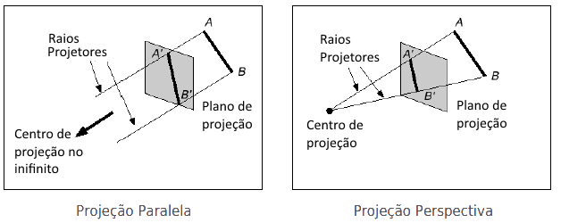
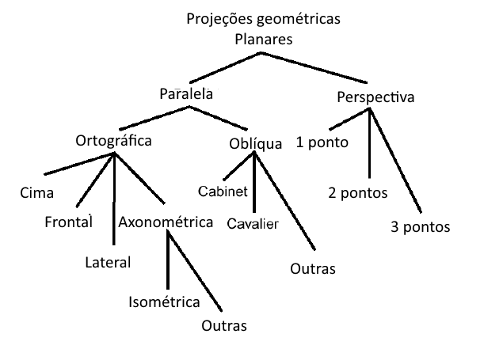
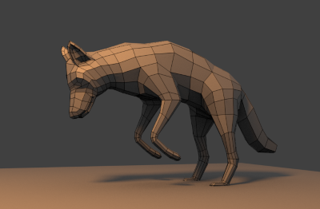
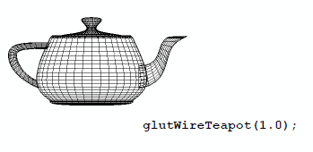
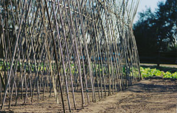

# Projeção

---
# Objetivos

1. Entender a transformação de uma cena em 3D para 2D
1. Conhecer as matrizes de projeção ortogonal e perspectiva
1. Entender o funcionamento da projeção em OpenGL

---
## Projeção

- Transformações de projeção são aquelas capazes de representar pontos
  ou objetos a partir de um espaço tridimensional (uma cena) em um plano
  bidimensional (uma imagem).

  

---
## Projeção

- De forma geral, trata-se de representar objetos de R<sup>n</sup> em
  R<sup>n-1</sup>

  

---
## Relembrando o pipeline gráfico


---
## O problema da projeção em Computação Gráfica

- Trata-se de transformar o volume de visualização em um volume de cubo
  unitário, descartando as coordenadas Z dos vértices
  - Na verdade, as coordenadas Z saem dos vértices e vão para o Z-buffer
- Essa transformação é feita por meio de uma matriz que vai multiplicar as
  coordenadas dos vértices

---
## Elementos da projeção


---
## Elementos da projeção

1. Plano de projeção
  - Definido pelo sistema de coordenadas da câmera (ou do olho)
1. Raios de projeção
  - Raios que ligam um ponto no espaço tridimensional à imagem 2D
representada no plano de projeção
1. Centro de projeção
  - ponto fixo na cena de onde todos os raios de projeção surgem

---
## Tipos de projeção



---
## Outros tipos de projeção



---
# Projeção Paralela

---
## Projeção Paralela

- 
  Centro de projeção se encontra no infinito
- Raios de projeção são paralelos entre si
- Tamanho relativo em cada eixo é preservado
- Linhas paralelas permanecem paralelas
- Existem subtipos de projeção paralela em que o ângulo de incidência dos raios
  de projeção varia

---
## Projeção Paralela, Ortogonal


- Projeção ortogonal
  - Ângulo dos raios no plano de projeção = 90º

---
## Projeção Paralela, Isométrica


- A cena é orientada em 45º relativo ao plano de projeção

---
# Projeção Perspectiva

---
## Projeção Perspectiva


- A Projeção Perspectiva mapeia os pontos no plano de projeção ao longo dos
  raios de projeção que emanam de um centro de projeção

---
## Características da Projeção Perspectiva

1. Objetos mais próximo ao plano de projeção são maiores
1. Linhas paralelas se encontram em pontos de fuga
1. Aparência semelhante ao modelo do nosso olho

---
# Objetos 3D

---
## Objetos 3D

- Um objeto tridimensional é formado por várias faces (triângulos) adjacentes
  que podem estar no mesmo plano ou não
  
  

---
## Exemplo de objetos 3D

- Para desenhar um cubo em vez de um quadrado, precisamos desenhar 6 faces em
  vez de 1
  ```c
  glBegin(GL_QUADS);
    // Cima (y = 1.0f)
    glColor3f(0.0f, 1.0f, 0.0f);
    glVertex3f( 1.0f, 1.0f, -1.0f);
    glVertex3f(-1.0f, 1.0f, -1.0f);
    glVertex3f(-1.0f, 1.0f,  1.0f);
    glVertex3f( 1.0f, 1.0f,  1.0f);

    // Baixo
    glColor3f(1.0f, 0.5f, 0.0f);
    glVertex3f( 1.0f, -1.0f,  1.0f);
    glVertex3f(-1.0f, -1.0f,  1.0f);
    glVertex3f(-1.0f, -1.0f, -1.0f);
    glVertex3f( 1.0f, -1.0f, -1.0f);

    //...

  ```
---
## Roubando com o GLUT

- O GLUT (OpenGL Utilities Toolkit) possui algumas funções para desenho de
  objetos tridimensionais
  1. `glutSolidTeapot, glutWireTeapot`

     
- [Referência das funções](https://www.opengl.org/resources/libraries/glut/spec3/node80.html)

---
## Formas 3D do GLUT


---
## Formas 3D do GLUT (cont.)


---
# Projeção em OpenGL

---
## glOrtho ([referência](http://earth.uni-muenster.de/~joergs/opengl/glOrtho.html))

- 
  Assinatura da função
  ```c
  void glOrtho(double left,
               double right,
               double bottom,
               double top,
               double near,
               double far);
  ```
- A função multiplica a matriz corrente por uma matriz da forma ao lado

---
## glFrustum ([referência](http://earth.uni-muenster.de/~joergs/opengl/glFrustum.html))


- Assinatura da função
  ```c
  void glFrustum(double left,   double right,
                 double bottom, double top,
                 double near,   double far);
  ```

---
## glFrustum (cont.)

- 
  A função multiplica a matriz corrente por uma matriz da forma acima
- A matriz de projeção (independente se `glOrtho` ou `glFrustum`) deve ser
  colocada na **pilha de matrizes de projeção do OpenGL**
  ```c
  glMatrixMode(GL_PROJECTION);
  glLoadIdentity();
  glFrustum(-1, 1, -1, 1, 1, 20);
  ```

---
## gluPerspective

- Não é muito intuitivo configurar a perspectiva usando glFrustum
- Uma forma mais comum para configurar perspectiva é usando dois parâmetros
  1. Um ângulo para o campo de visão
  1. Razão de aspecto (largura / altura)
- 

---
## gluPerspective (cont.)

- A biblioteca GLU (OpenGL Utilities) contém uma função para isso, o
  `gluPerspective`
  ```c
  glMatrixMode(GL_PROJECTION);
  glLoadIdentity();

  // fovy, aspect, nearZ, farZ
  gluPerspective(45.0f, 4.0f/3.0f, 1, 20);
  ```
- O `gluPerspective` chama o `glFrustum` internamente

---
## gluPerspective (cont.)

- Campo de visão (_fov_)
  - Determina o quanto queremos enxergar da cena
  - Valores maiores acarretam em um campo de visão maior - espelho côncavo
  - Para aplicações interativas, tipicamente algo entre 45º e 60º

---
## gluPerspective (cont.)

- 
  
  
  

---
## gluPerspective (cont.)

- Razão de aspecto
  - Divisão da largura pela altura
  - Deve ser a mesma razão de aspecto da janela/tela em que estamos desenhando
    para que não haja distorção

---
## gluLookAt

- Além de configurar a projeção que queremos (via `glOrtho, glFrustum, glPerspective`),
  queremos também poder **posicionar** e **mirar** nossa câmera virtual

  

- É uma transformação de visualização - ou seja, usamos a pilha de matrizes
  `GL_MODELVIEW`

---
## gluLookAt (cont.)

```c
void gluLookAt(	double eyeX,
                 double eyeY,
                 double eyeZ,
                 double centerX,
                 double centerY,
                 double centerZ,
                 double upX,
                 double upY,
                 double upZ);
```

---
# Referências

- Capítulo 3 do livro Real-Time Rendering
- Lições 5 e 8 das anotações do prof. David Mount
