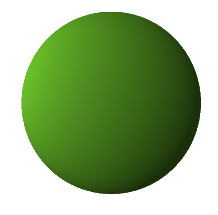
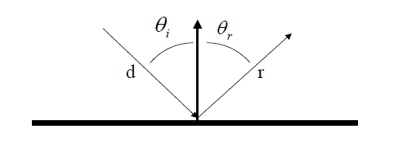

# _Ray tracing_ parte 2

---
# Objetivos

<ol>
  <li>Relembrar as duas grandes perguntas fundamentais para ~~a vida, o universo e tudo o mais~~ se criar um _ray tracer_
  <li class="appear-right" style="list-style-type: none;"></li>
  <li>Entender **como retornar uma cor do polígono atingido** pelo raio</li>
  <li>Revisitar o modelo de iluminação local de **phong**</li>
  <li>Mais efeitos com **_ray tracing_ distribuído**</li>
</ol>

---
# Perguntas fundamentais

---
## Perguntas fundamentais

- Para implementar um _ray tracing_, precisamos responder a pelo menos 2
perguntas:
  1. Como determinar qual objeto (se) um raio intercepta?
  1. Dado que **um raio atingiu um objeto**, como devemos **calcular a cor retornada**?
- Na última aula, vimos/implementamos a verificação de interseção entre raio e
  esfera
  - Criamos um sistema entre a equação da reta (raio) e a equação
    implícita da esfera
    - Isso dá uma equação de 2º grau em relação ao parâmetro t e suas raízes
      equivalem ao(s) ponto(s) t da reta em que há interseção

---
## Perguntas fundamentais

- Hoje veremos como podemos calcular a cor que deve ser retornada por um raio quando
  ele atinge um objeto
- Vamos considerar que cada objeto tem uma cor com que ele foi pintado. Assim,
  vejamos **algumas opções**:
  1. Se raio atingiu objeto, retorne **sempre a mesma cor do objeto** (o que foi feito na parte 1)
  1. Se raio atingiu objeto, **considerar as fontes de luz** e a cor do objeto
    - Mas como devemos/podemos/queremos considerar as fontes de luz?
    
---
## Como colorir um pixel?

- Assim como temos diferentes modelos de iluminação local, também podemos
  **ter formas diferentes para se colorir um pixel** usando um _ray tracer_
- 
  Se o objetivo for realismo, podemos pegar emprestado **os modelos
  de iluminação e de sombreamento de Phong**
- Se o objetivo for não-realista, podemos, por exemplo, desenhar apenas as
  silhuetas dos objetos (\Delta = 0 na equação de interseção)

---
## Objetivo não-realista

- Chamado de NPR: _non-photorrealistic rendering_
- Exemplo: [Choudhury e Parker, 08](http://www.sci.utah.edu/~roni/research/projects/NPR-lines-poster/)

  

---
## Objetivo não-realista (Zelda Wind Waker)

- Renderização em **tempo real** (no jogo mesmo, de GameCube)

---
<!--
backdrop: wind-waker-raytraced
-->

# Renderização [via ray tracing](http://www.reddit.com/r/gaming/comments/idmkd/wind_waker_rendered_photoreal/)

---
<!--
backdrop: wind-waker-raytraced-2
-->

---
## Objetivo realista

- Voltando à renderização com objetivo realista, podemos usar o modelo de
  **Phong** (iluminação e sombreamento) para colorir um pixel
  - O modelo de sombreamento de Phong é o da interpolação de normais, com o
    cálculo da função de **iluminação** (contribuição de cada fonte de luz) sendo
    chamado **para cada ponto do objeto**
  - Ele é mais caro do que o sombreamento de Gouraud, porém estamos
    interessados mais na **qualidade da imagem** do que na velocidade de
    geração da imagem

---
# Modelo de Phong

---
## Modelo de Phong

- A cor é dividida em três componentes:
  1. Cor **ambiente** (cor do objeto não iluminado)
  1. Cor **difusa** (cor do objeto iluminado)
  1. Cor e coeficiente **especular** (cor e tamanho da aparência brilhosa)

---
<!--
scripts: ['../../scripts/classes/phong-vectors.js'] 
-->

## Equação de iluminação de _Phong_

<svg xmlns:svg="http://www.w3.org/2000/svg" xmlns="http://www.w3.org/2000/svg" viewBox="0 0 1257 687" width="400" height="218" class="phong-vectors" version="1"><defs id="defs4"><marker orient="auto" refY="0" refX="0" id="Arrow1Mend" overflow="visible"><path id="path2934" d="M0 0L5-5-12.5 0 5 5 0 0z" transform="matrix(-0.4,0,0,-0.4,-4,0)" style="fill-rule:evenodd;stroke-width:1;stroke:black"/></marker></defs><metadata id="metadata7"/><g id="layer1" transform="translate(200.699,94.93883)"><g id="g4006"><path d="M294.4-1.8L290.6-1.2 383.5 577.9 387.3 577.3 294.4-1.8z" id="path3996" style="fill-rule:evenodd;fill:black"/><path d="M294.9 13.5L303.6 19.8 291.9-5.2 288.6 22.2 294.9 13.5z" id="path4012" style="fill-rule:evenodd;stroke-width:1.52;stroke:black"/></g><g id="g4014"><path d="M382.5-9.1L383.9 577.4 387.7 577.4 386.2-9.1 382.5-9.1z" id="path3992" style="fill-rule:evenodd;fill:black"/><path d="M384.4 6.1L392 13.7 384.4-12.9 376.8 13.8 384.4 6.1z" id="path4020" style="fill-rule:evenodd;stroke-width:1.52;stroke:black"/></g><g id="g4030"><path d="M913.4 316.4L387.7 576.4 389.4 579.8 915.1 319.8 913.4 316.4z" id="path1876" style="fill-rule:evenodd;fill:black"/><path d="M900.7 324.8L897.2 335 917.7 316.4 890.5 321.4 900.7 324.8z" id="path4036" style="fill-rule:evenodd;stroke-width:1.52;stroke:black"/></g><g id="g3998"><path d="M-136.3 316.4L-138 319.8 387.7 579.8 389.4 576.4-136.3 316.4z" id="path1878" style="fill-rule:evenodd;fill:black"/><path d="M-123.5 324.8L-113.3 321.4-140.5 316.4-120.1 335-123.5 324.8z" id="path4004" style="fill-rule:evenodd;stroke-width:1.52;stroke:black"/></g><text x="822.7" y="312" id="text2950" style="fill:black;font-family:Bitstream Vera Sans;font-size:84.27"><tspan id="tspan2952" x="822.7" y="312">S</tspan></text><text id="text2954" y="327.1" x="-207.3" style="fill:black;font-family:Bitstream Vera Sans;font-size:84.27"><tspan y="327.1" x="-207.3" id="tspan2956">R</tspan></text><text x="241.4" y="131.6" id="text2958" style="fill:black;font-family:Bitstream Vera Sans;font-size:84.27"><tspan id="tspan2960" x="241.4" y="131.6">V</tspan></text><text id="text2962" y="13.9" x="396.7" style="fill:black;font-family:Bitstream Vera Sans;font-size:84.27"><tspan y="13.9" x="396.7" id="tspan2964">N</tspan></text><g id="g4022" class="reveal-on-complete"><path d="M654.1 55.1L385.4 576.4 388.8 578.2 657.4 56.8 654.1 55.1z" id="path3855" style="fill-rule:evenodd;fill:black"/><path d="M648.8 69.5L652.1 79.7 657.5 52.6 638.5 72.8 648.8 69.5z" id="path4028" style="fill-rule:evenodd;stroke-width:1.52;stroke:black"/></g><text id="text3857" y="32" x="651.3" class="reveal-on-complete" style="fill:black;font-family:Bitstream Vera Sans;font-size:84.27"><tspan y="32" x="651.3" id="tspan3859">H</tspan></text><g id="g3979" transform="matrix(0.341951,0,0,0.341951,432.4147,-336.0555)"><path id="path1872" d="M-671.3 857.6C-541.5 716.5-359.4 664.1-266.1 828" style="fill:none;stroke-miterlimit:4;stroke-width:20.32;stroke:black"/><path transform="matrix(0.79671,0,0,0.79671,-732.744,491.0467)" d="M457.1 462.4A38.6 38.6 0 1 1 380 462.4 38.6 38.6 0 1 1 457.1 462.4z" id="path2762" fill="none"/><path transform="matrix(0.929495,0,0,0.908249,-785.4786,452.7005)" d="M448.6 415.2A68.6 71.4 0 1 1 311.4 415.2 68.6 71.4 0 1 1 448.6 415.2z" id="path3649" fill="black"/><path id="path3652" d="M-670.9 857.5C-541.4 704.9-359.6 648.4-266.5 825.5" style="fill:none;stroke-miterlimit:4;stroke-width:21.1;stroke:black"/><path id="path3732" d="M448.6 415.2A68.6 71.4 0 1 1 311.4 415.2 68.6 71.4 0 1 1 448.6 415.2z" transform="matrix(0.745004,0,0,0.727975,-715.3717,527.5541)" fill="#ccc"/><path transform="matrix(0.329897,0,0,0.322356,-557.6311,695.9748)" d="M448.6 415.2A68.6 71.4 0 1 1 311.4 415.2 68.6 71.4 0 1 1 448.6 415.2z" id="path3734" fill="black"/><path id="path1874" d="M-612.1 865.1C-525.6 774.1-370.8 714.9-295.7 871.9-368.5 917.5-460.7 926.6-523.3 891.3" style="fill:none;stroke-miterlimit:4;stroke-width:18.42;stroke:black"/></g><path id="path3988" d="M1028.5 338.1L1001.4 314.6 1004.5 350.4 988.4 318.3 977.6 352.5 975 316.7 951.9 344.2 963.2 310.1 931.4 326.7 954.9 299.5 919.1 302.6 951.2 286.5 917 275.7 952.8 273.1 925.3 250.1 959.4 261.4 942.8 229.5 970 253 966.9 217.3 982.9 249.3 993.8 215.1 996.3 250.9 1019.4 223.4 1008.1 257.5 1040 240.9 1016.5 268.1 1052.2 265 1020.2 281.1 1054.4 291.9 1018.6 294.5 1046.1 317.6 1012 306.2 1028.5 338.1z" style="fill:none;stroke-linejoin:round;stroke-miterlimit:4;stroke-width:3.8;stroke:black"/><path d="M42.9 584.1L720 584.1" id="path3990" style="fill:none;stroke-miterlimit:4;stroke-width:15.2;stroke:black"/></g></svg>

- Equação: L(V) = k_aL_a + k_d\sum_iL_i(S_i \cdot N) + k_s\sum_iL_i(R_i \cdot V)^{k_e}
  - \vec{N} - normal do objeto no ponto de interseção
  - \vec{S} - incidência da luz
  - \vec{R} - vetor de reflexão da luz
  - \vec{V} - vetor de visualização (do olho até ponto de interseção)

---
## Parâmetros do (**material** do) objeto

- O objeto possui:
  1. Uma cor C
  1. Três coeficientes ([0,1]) que respondem a:
    1. O quanto responde à **luz ambiente** (k_a)
    1. O quanto responde à reflexão lambertiana - cor difusa(k_d)
    1. O quanto responde à reflexão brilhosa - efeito especular (k_s)

---
## Parâmetros de cada **fonte de luz**

- Cada fonte de luz (onidirecional) possui:
  1. Posição no mundo
  1. Uma cor C_l
  1. 3 coeficientes de atenuação (constante, linear e quadrático)
    - c, l e q

---
## Calculando os vetores

- Ponto de interseção
  - Vem do cálculo da interseção (`ray.intersectionT`)
- Vetor normal
  - Idem (`ray.intersectionNormal`)
- Vetor incidência de luz
  - Posição da luz - ponto de interseção (normalizar)
- Vetor reflexão
  - Próximo slide
- Vetor de visualização
  - Posição da câmera - ponto de interseção (normalizar)

---
## Reflexão lambertiana

- Reflexão:
  - O ângulo de incidência do raio é igual ao ângulo de reflexão

---
## Calculando vetor de reflexão

- \vec{S} é o vetor que sai do ponto de interseção até a fonte de luz
- \vec{r} é o raio refletido (que queremos encontrar)
- \Theta_r e \Theta_i são iguais

---
## Calculando vetor de reflexão (cont.)

- Podemos usar produto interno para calcular a projeção de um vetor no outro
  - \vec{a} = -(\vec{S} - ( \left | \vec{a} \right | \cos{\Theta}) \vec{N})
- Assim, encontramos \vec{a} e o somamos duas vezes
  - Equação: \vec{r} = \vec{S} + 2\vec{a}

---
# Referências

- Aulas 18 e 19 do prof. David Mount (link na página do curso)
- Capítulo 10 do livro **Computer Graphics with OpenGL** de _Hearn and Baker_
