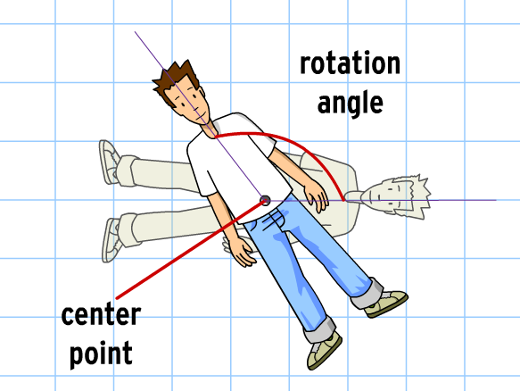
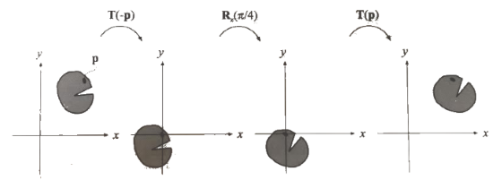
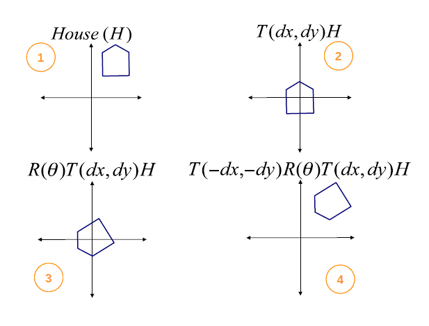

# Transformações Geométricas



---
# Roteiro

1. Introdução a transformações
1. Translação
1. Rotação
1. Escala
1. Inclinação
1. Composição
1. Push, Pop

---
# Introdução a transformações

---
## Teoria geométrica das transformações

- Transformação é uma função que **mapeia pontos de um espaço Euclidiano em
  outros pontos** do mesmo espaço.
- Se uma transformação é linear, então:
  - Se um conjunto de pontos está contido em uma reta, depois de
    transformados eles também estarão contidos sobre uma reta.
  - Se um ponto <span class="math">P</span> guarda uma relação de distância
    com dois outros pontos <span class="math">Q</span> e
    <span class="math">R</span>, então essa relação de distância é mantida.

---
## Prática das transformações (em OpenGL)

- Desenhamos quaisquer objetos em OpenGL **descrevendo seus vértices**:
  ```c
  glVertex3f(x, y, z);
  ```
- Podemos alterar as coordenadas dos vértices sem alterar o valor de
  <span class="math">x, y</span> e <span class="math">z</span> de forma a:
  - Rotacioná-los (`glRotate`)
  - Movimentá-los (`glTranslate`)
  - Alterarmos seu tamanho (`glScale`)
  - Outras transformações
    - Espelhamento ou reflexão
    - Inclinação (_shearing_)

---
## **Forma geral** de ponto ou vetor

- Na geometria afim, vimos que podemos representar um ponto ou um vetor na
  forma:
  <div class="math">R = \alpha_0 F.\vec{e_0} + \alpha_1 F.\vec{e_1} + \alpha_2 F.\vec{e_2} + \alpha_3 F.O</div>

  - Em que <u><span class="math">R</span> é um ponto ou um vetor</u>
    representado em termos do sistema de coordenadas <span class="math">F</span>, **<span class="math">\alpha_3</span>** é <span class="math">0</span>
      para vetores ou <span class="math">1</span> para pontos (é a **coordenada
      homogênea**)
  - No sistema de coordenadas cartesiano, escrevemos
    <span class="math">R</span> como:
    <div class="math">R = \alpha_x \vec{x} + \alpha_y \vec{y} + \alpha_z \vec{z} + \alpha_w</div>
- <div class="math" style="float:right;">R = \begin{bmatrix}\alpha_x & \alpha_y&\alpha_z&\alpha_w\end{bmatrix}^T</div>
  Mais sucintamente, dizemos que:

---
## Forma matricial de ponto ou vetor

- Podemos representar um ponto ou vetor <span class="math">R</span> na
  forma matricial:
  <figure class="picture-steps clean">
    <div class="bullet">
    <div class="math" style="padding-top: 1px;">R = \begin{bmatrix} F.\vec{e_0}\\\F.\vec{e_1}\\\F.\vec{e_2}\\\F.O \end{bmatrix} \times \begin{bmatrix} \alpha_0\\\\\\alpha_1\\\\\\alpha_2\\\\\alpha_3 \end{bmatrix}</div>
    Cada linha da matriz é um vetor (as 3 primeiras) ou a origem de uma base (a última)
    </div>
    <div class="bullet">
    <div class="math">R = \begin{bmatrix} F.\vec{e_0}[0] & F.\vec{e_0}[1] & F.\vec{e_0}[2] & 0\\\F.\vec{e_1}[0] & F.\vec{e_1}[1] & F.\vec{e_1}[2] & 0\\\F.\vec{e_2}[0] & F.\vec{e_2}[1] & F.\vec{e_2}[2] & 0\\\F.O[0] & F.O[1] & F.O[2] & 1 \end{bmatrix} \times
    \begin{bmatrix} \alpha_0\\\\\\alpha_1\\\\\\alpha_2\\\\\alpha_3 \end{bmatrix}</div>
    ...expandindo a matriz, mostrando as coordenadas de cada vetor da base/ponto de origem...
    </div>
    <div class="bullet">
    <div class="math">R = \begin{bmatrix} 1 & 0 & 0 & 0\\\0 & 1 & 0 & 0\\\0 & 0 & 1 & 0\\\0 & 0 & 0 & 1 \end{bmatrix} \times
    \begin{bmatrix} \alpha_0\\\\\\alpha_1\\\\\\alpha_2\\\\\alpha_3 \end{bmatrix}</div>
    Exemplo: a base cartesiana, com origem em (0,0,0)
    </div>
  </figure>

---
## Uma função de <span class="math">T</span>ransformação

- Das propriedades da geometria afim, podemos propor **uma função
  <span class="math">T</span>** que, se aplicada a cada componente da
  equação anterior, **se mantém uma equação afim**:

  <div class="math">R = \alpha_0 F.\vec{e_0} + \alpha_1 F.\vec{e_1} + \alpha_2 F.\vec{e_2} + \alpha_3 F.O</div>
  <div class="math">\color{blue}{T(}R\color{blue}{)} = \alpha_0 \color{blue}{T(}F.\vec{e_0}\color{blue}{)} + \alpha_1 \color{blue}{T(}F.\vec{e_1}\color{blue}{)} + \alpha_2 \color{blue}{T(}F.\vec{e_2}\color{blue}{)} + \alpha_3 \color{blue}{T(}F.O\color{blue}{)}</div>
  - Podemos chamar essa função <span class="math">T</span> de **transformação**

---
## Forma matricial da transformação

- Podemos representar a equação anterior na forma matricial:

  <figure class="picture-steps clean" style="margin-left: 0;">
    <div class="bullet math">T(R) = \begin{bmatrix} T(F.\vec{e_0})\\\T(F.\vec{e_1})\\\T(F.\vec{e_2})\\\T(F.O) \end{bmatrix}
  \begin{bmatrix} \alpha_0\\\\\\alpha_1\\\\\\alpha_2\\\\\alpha_3 \end{bmatrix}</div>
    <div class="bullet math">T(R) = \begin{bmatrix} T(F.\vec{e_0}[0]) & T(F.\vec{e_0}[1]) & T(F.\vec{e_0}[2]) & 0)\\\T(F.\vec{e_1}[0]) & T(F.\vec{e_1}[1]) & T(F.\vec{e_1}[2]) & 0)\\\T(F.\vec{e_2}[0]) & T(F.\vec{e_2}[1]) & T(F.\vec{e_2}[2]) & 0)\\\T(F.O[0]) & T(F.O[1]) & T(F.O[2]) & 1) \end{bmatrix} \times
    \begin{bmatrix} \alpha_0\\\\\\alpha_1\\\\\\alpha_2\\\\\alpha_3 \end{bmatrix}</div>
  </figure>

- As linhas representam as imagens dos elementos do sistema <span class="math">F</span> transformado
  por <span class="math">T</span>
- Disso temos que **aplicar uma <u>transformação afim é equivalente a
  multiplicar as coordenadas</u> (de um ponto ou vetor) <u>por uma matriz</u>**
  - Em <span class="math">n</span> dimensões, isso equivale a uma matriz <span class="math">(n + 1)(n + 1)</span> por causa da coordenada homogênea

---
## Exemplo: Transformação Nula

- <div class="math" style="float: right;">T=\begin{bmatrix} 1&0&0&0\\\0&1&0&0\\\0&0&1&0\\\0&0&0&1 \end{bmatrix}</div>
  **A transformação nula** é aquela que mantém as coordenadas dos pontos e vetores inalterada - ou seja, dada pela **matriz identidade**:
    <div style="clear: right;"></div>

- Supondo o sistema de coordenadas cartesiano e um ponto <span class="math">P=\begin{bmatrix} \alpha_x&\alpha_y&\alpha_z&1 \end{bmatrix}^{T}</span>, temos que:

  <figure class="picture-steps clean">
    <div class="bullet math">T(P)=\begin{bmatrix} 1&0&0&0\\\0&1&0&0\\\0&0&1&0\\\0&0&0&1 \end{bmatrix} \begin{bmatrix} \alpha_x\\\\\\alpha_y\\\\\\alpha_z\\\1 \end{bmatrix}=?</div>
    <div class="bullet math">T(P)=\begin{bmatrix} 1&0&0&0\\\0&1&0&0\\\0&0&1&0\\\0&0&0&1 \end{bmatrix} \begin{bmatrix} \alpha_x\\\\\\alpha_y\\\\\\alpha_z\\\1 \end{bmatrix}=\begin{bmatrix} \alpha_x\\\\\\alpha_y\\\\\\alpha_z\\\1 \end{bmatrix}</div>
  </figure>

---
## A [Magnífica Matriz 2D](http://ncase.me/matrix/)

<iframe src="http://ncase.me/matrix/" width="800" height="537"></iframe>

---
# Tipos comuns de transformações

---
## **Translação**

- A transformação de translação move um objeto de uma posição para outra.

  

---
## Translação (cont.)

- Mantém os ângulos e comprimentos
- Pode ser representada por uma matriz <span class="math">T(\vec{t})</span>, em que <span class="math">\vec{t}</span> é o vetor de deslocamento:

  <div class="math">
  \begin{bmatrix}
  1&0&0&t_x\\\0&1&0&t_y\\\0&0&1&t_z\\\0&0&0&1
  \end{bmatrix}
  \begin{bmatrix}
  p_x\\\p_y\\\p_z\\\1
  \end{bmatrix}
  =
  \begin{bmatrix}
  p_x+t_x\\\p_y+t_y\\\p_z+t_z\\\1
  \end{bmatrix}
  </div>

---
## Translação em OpenGL

- Em OpenGL, usamos o método `glTranslate` para multiplicar a matriz atual pela
  matriz de translação gerada pelo `glTranslate`
- Assinatura da função ([referência](https://www.opengl.org/sdk/docs/man2/xhtml/glTranslate.xml)).
  ```c
  void glTranslated(double x, double y, double z);
  void glTranslatef(float x, float y, float z);
  ```

---
## Translação em OpenGL (cont.)

- Dentro de uma função de desenho:
  ```c
  glTranslatef(player.x, player.y, 0);
  glBegin(GL_POLYGON);
      glVertex3f(-10, -10, 0);    glVertex3f(10, -10, 0);
      glVertex3f(10, 10, 0);      glVertex3f(-10, 10, 0);
  glEnd();
  glTranslatef(-player.x, -player.y, 0); // desfaz translação
  ```
- Benefícios
  - Podemos definir objetos (vértices) em um **sistemas de coordenadas local**
    a ele
  - Podemos guardar objetos em _display lists_ já que
    estão definidos em um sistema local e transladá-los em qualquer posição

---
## Matriz inversa da translação

- Pode-se usar a matriz inversa de uma transformação para **se desfazer a
  operação** efetuada por ela
- A matriz inversa de uma translação <span class="math">T(\vec{t})</span> é dada por <span class="math">T^{-1}(\vec{t})</span> tal que:
  - <span class="math">T^{-1}(\vec{t})=T(-\vec{t})</span>
  - Ou seja, basta multiplicar o vetor <span class="math">\vec{t}</span> de deslocamento por <span class="math">-1</span> para se obter a
    matriz inversa

---
## **Rotação**

- A rotação de um objeto é especificada por:
  - um **ângulo** de rotação e
  - um **eixo** de rotação.
- Todos os vértices do objeto são transformados para novas posições por meio
  da rotação dos pontos em um ângulo especificado com **relação à origem**.

---
## Rotação (cont.)

- Equações para a rotação de um ponto <span class="math">(x, y)</span>
  através de um ângulo <span class="math">\theta</span> com relação à origem:

  

---
## Rotação (cont.)

- Podemos rotacionar objetos **ao longo dos três eixos** da base do
  nosso sistema de coordenadas: <span class="math">(x,y,z)</span>
  - Exemplo: nossa cabeça olha para cima ou baixo, esquerda ou direita e
    deita-se para a direita ou esquerda
  - Se rotacionarmos vértices em <span class="math">x</span>, suas coordenadas
    <span class="math">y</span> e <span class="math">z</span> alteram, mas
    <span class="math">x</span> se mantêm
    
    - Portanto, em 2D, para rotacionar um objeto provavelmente queremos usar o
      eixo Z

---
## Rotação no **eixo Z**

- Pode ser representada por uma matriz <span class="math">R_{z}(\alpha)</span>, em que <span class="math">\alpha</span> é o ângulo de
  rotação.

  <div class="math">R_{z}(\alpha)=\begin{bmatrix} \cos\alpha&- \sin\alpha&0&0\\\ \sin\alpha&\cos\alpha&0&0\\\0&0&1&0\\\0&0&0&1 \end{bmatrix}</div>

---
## Rotação nos **eixos X e Y**

- Similarmente, as matrizes de rotação nos eixos <span class="math">x</span> e <span class="math">y</span>:

  <div class="math" style="float:left;">R_x(\alpha)=\begin{bmatrix} 1&0&0&0\\\0&\cos\alpha&-\sin\alpha&0\\\0&\sin\alpha&\cos\alpha&0\\\0&0&1&0\end{bmatrix}</div>

  <div class="math" style="float:right;">R_y(\alpha)=\begin{bmatrix} \cos\alpha&0&\sin\alpha&0\\\0&1&0&0\\\ -\sin\alpha&0&\cos\alpha&0\\\0&0&0&1\end{bmatrix}</div>

---
## Rotação em OpenGL

- Em OpenGL, usamos o método `glRotate` para multiplicar a matriz atual pela
  matriz de rotação gerada pelo `glRotate`
- Assinatura da função ([referência](https://www.opengl.org/sdk/docs/man2/xhtml/glRotate.xml)):
  ```c
  void glRotated(double angle, double x, double y, double z);
  void glRotatef(float angle, float x, float y, float z);
  ```

---
## Rotação em OpenGL (cont.)

- Dentro de uma função de desenho:
  ```c
  glRotatef(player.angle, 0, 0, 1);   // eixo z
  glBegin(GL_POLYGON);
      glVertex3f(-10, -10, 0);    glVertex3f(10, -10, 0);
      glVertex3f(10, 10, 0);      glVertex3f(-10, 10, 0);
  glEnd();
  glRotatef(-player.angle, 0, 0, 1);  // desfaz
  ```

---
## Matriz inversa da rotação

- A matriz de rotação é ortogonal, ou seja, **sua inversa é sua
  transposta**
- Dada uma matriz de rotação <span class="math">R(\alpha)</span>, sua matriz inversa <span class="math">R^{-1}(\alpha)</span>
  é dada por:
  - <span class="math">R^{-1}(\alpha)</span> = <span class="math">R^T(\alpha)</span>
- Também é possível obter a inversa da matriz de rotação usando **a negação do
  ângulo de rotação**:
  - <span class="math">R^{-1}(\alpha)=R(-\alpha)</span>


---
## Rotação em torno de um ponto

- Quando rotacionamos um objeto, o fazemos em relação à origem


---
## Rotação em torno de um ponto (cont.)

- Para rotacionar **um objeto que não está na origem em torno de si mesmo**,
  precisamos, primeiro  (1) movê-lo até a origem, (2) rotacionar e (3) movê-lo
  de volta à sua posição original

  
- Assim, fazemos uma **transformação composta** dada pela matriz obtida pela multiplicação:
  - <span class="math">M = T(\vec{p})R_z(45)T(-\vec{p})</span>

---
## Rotações em geral (quaisquer eixos)

- Uma rotação em **eixos arbitrários** pode ser definida pela multiplicação das
  matrizes de rotação em cada eixo

  <div class="math">E(h, p, r) = R_z(r)R_x(p)R_y(h)</div>
- Chamada de transformação de Euler
- É a matriz gerada pelo `glRotate`

---
# Escala

---
## Escala

- A transformação de escala altera o tamanho do objeto
  - Além de alterar o tamanho do objeto (espaço entre vértices), a operação
    também os move

    

---
## Escala (cont.)

- Uma transformação de escala simples é realizada pela multiplicação das
  posições <span class="math">(x,y,z)</span> de um objeto por fatores escalares <span class="math">s_x, s_y, s_z</span>
- A transformação de escala pode ser representada por uma matriz <span class="math">S</span> tal que:

  <div class="math" style="float: right;">S(\vec{s})=\begin{bmatrix} s_x&0&0&0\\\0&s_y&0&0\\\0&0&s_z&0\\\0&0&0&1 \end{bmatrix}</div>

---
## Escala em OpenGL

- Em OpenGL, usamos o método `glScale` para multiplicar a matriz atual pela
  matriz de escala gerada por ele
- Assinatura da função ([referência](https://www.opengl.org/sdk/docs/man2/xhtml/glScale.xml)):
  ```c
  void glScaled(double x, double y, double z);
  void glScalef(float x, float y, float z);
  ```

---
## Escala em OpenGL (cont.)

- Dentro de uma função de desenho:
  ```c
  if (player.isSmall) {
    glScalef(0.5, 0.5, 0.5);      // uniforme, 50%
  }
  glBegin(GL_POLYGON);
    glVertex3f(-10, -10, 0);    glVertex3f(10, -10, 0);
    glVertex3f(10, 10, 0);      glVertex3f(-10, 10, 0);
  glEnd();
  if (player.isSmall) {
    glScalef(1/.5, 1/.5, 1/.5);   // desfaz
  }
  ```

---
# Inclinação

- Equivale a "entortar" um objeto (seus vértices) em certo eixo

  

---
## Inclinação (cont.)

- Em 3D, pode ocorrer em 1 de 6 combinações de planos de coordenadas
- <div class="math" style="float: right;">H_{xy}(\vec{sh})=\begin{bmatrix} 1&0&sh_x&0\\\0&1&sh_y&0\\\0&0&1&0\\\0&0&0&1 \end{bmatrix}</div>
  Matriz da transformação no plano <span class="math">xy</span>


---
## Inclinação em OpenGL

- **<u>Não existe um `glShear`</u>**, portanto precisamos implementar a matriz nós mesmos
- O OpenGL possui o **`glMultMatrix`** que nos permite definir todas as coordenadas
  de uma matriz
  - `glRotate`, `glTranslate` e `glScale` chamam essa função
  - Referência do [glMultMatrix](https://www.opengl.org/sdk/docs/man2/xhtml/glMultMatrix.xml)

<!--
# Composição


## Composição

- Uma sequência de transformações podem ser combinadas em uma única
  matriz facilitando as operações.
- Exemplo, rotacionar um polígono ao redor de um pivô que não seja a origem:
  1. transladar o pivô para para a origem
  2. aplicar a rotação ao redor da origem
  3. transladar de volta ao ponto original


## Composição - Exemplo em 2D




## Composição (cont.)

- As três matrizes de transformação são combinadas como a seguir

  

- Lembre-se: multiplicação de matrizes não é comutativa - a ordem importa.
  - Além disso, o OpenGL **pré-multiplica** as matrizes
-->

---
# Push, Pop

---
## Push, Pop

- Quando chamamos uma **função de multiplicação de matriz**, estamos **alterando o
  estado** do OpenGL (máquina de estados)
- Assim, consecutivas chamadas a `glTranslatef(10, 0, 0)` irão mover os objetos
  da cena a `10u` em cada chamada

---
## Push, Pop (cont.)

- Em particular, existem 4 variáveis de estado que são matrizes
  - `GL_MODELVIEW`
  - `GL_PROJECTION`
  - `GL_TEXTURE`
  - `GL_COLOR`
- Na realidade, cada variável dessas é uma **pilha de matrizes**
- Para evitar esse efeito, podemos empilhar a matriz atual para **preservá-la**
  e então trabalhar na nova matriz que está no topo
- Usamos **`glMatrixMode(GL_...)`** para escolher com qual pilha de matrizes queremos aplicar transformações

---
## Push, Pop (cont.)

- **`glPushMatrix`** empilha a matriz corrente e a duplica no topo da pilha.
  - Ou seja, assim que `glPushMatrix` é chamada, as duas primeiras matrizes da
  pilha são idênticas
- **`glPopMatrix`** desempilha a matriz corrente
- **`glLoadIdentity`** define a matriz do topo como uma identidade
- **`glRotate, glTranslate`** etc., multiplicam a matriz do topo pela matriz de
  transformação correspondente

---
# Exemplo de Rotação com Animação

Veja este exemplo de [quadrado girando](codeblocks:tranformacao-rotacao/CodeBlocks/tranformacao-rotacao.cbp)
ao longo do tempo - ou seja, uma rotação no eixo Z de pequenos ângulos a cada
quadro.

- Usar `glPushMatrix()`/`glPopMatrix()` é preferível porque eles tornam
  desnecessários desfazer as transformações - que, tipicamente, se faz
  aplicando a transformação inversa

---
# Referências

- Capítulo 3 do livro Real-Time Rendering
- Lições 5 e 8 das anotações do prof. David Mount
