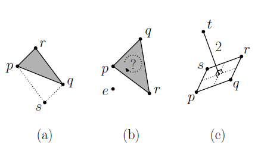

# Lista de Exercícios
## Geometria Analítica e Álgebra Linear

Utilize as seguintes aproximações, se precisar:
- sin 30° = cos 60° = 0.5
- sin 45° = cos 45° = 0.707
- sin 60° = cos 30° = 0.866
- π = 3.141, ✓2 = 1.414

As primeiras 7 questões referem-se à figura abaixo.

**Questão 1**: Qual é a equação deste círculo?

**Questão 2**: Quais são as coordenadas do ponto C?

**Questão 3**: Qual é a equação da tangente ao círculo em B?

**Questão 4**: Qual é o comprimento do arco menor do círculo entre A e B?

**Questão 5**: Quais são as coordenadas do ponto A?

**Questão 6**: Se o círculo for movido de tal forma que seu centro fique em
  (-3, -4), onde o ponto B ficaria?

**Questão 7**: Suponha que um outro círculo seja desenhado com seu centro em A
  e passando por O. Os dois círculos se intersectam em dois pontos. Qual o
  ângulo que suas tangentes fazem nesses pontos?

**Questão 8**: Se uma linha reta em um plano passa pelos pontos (3, 1) e (5, 2),
  por quais, se algum, dos seguintes dois pontos a reta também passa por cima:
  (9, 4) e (12, 6)?

**Questão 9**: Quais são as coordenadas do ponto médio do seguimento de linha
  reta que junta os pontos (3, 5) e (4, 7)?

**Questão 10**: Em que ponto as linhas retas 3x + 4y − 6 = 0
e 4x + 7y − 8 = 0 se intersectam?

## Geometria Afim e Euclidiana

**Questão 11**: Considerando as matrizes de transformação que vimos em aula (translação, rotação, escala), escreva a matriz (todos os elementos) de transformação **composta** (quando aplicável) para as operações seguintes. Você deve escrever as matrizes com as coordenadas homogêneas.

1. Translação em 2D com um deslocamento t = (4, 9)
1. Rotação 2D no eixo Z por um ângulo &theta; = π/4
   - Considere `sin(π/4) = cos(π/4) = 0,71`
1. Rotação 3D no eixo Z por um ângulo &theta; = π/4
1. Escala uniforme de 50% (metade do tamanho) em 3D
1. Escala não uniforme de 200% no eixo x, 75% no eixo y em 2D
1. Reflexão pelos eixos X e Y em 2D
1. Rotação em 2D em relação ao ponto P(5,2)

**Questão 12**: Para cada uma das tarefas a seguir, explique como você a resolveria usando métodos das geometrias afim ou euclidiana que discutimos em sala. Tente expressar suas respostas em termos de operações de alto nível como combinações afins, produto interno e produto vetorial em vez de manipulações de coordenadas de baixo nível ou funções trigonométricas.

1. Dado um triângulo `△pqr` no plano, explique como determinar um quarto ponto s tal que `{p, s, q, r}` defina um paralelogramo que tem pq como diagonal (veja Figura a).

1. Um observador está localizado em um ponto `e` no espaço R3 e ele enxerga um triângulo definido pelos vértices `p`, `q` e `r`. O lado da frente desse triângulo é o lado para o qual `p`, `q` e `r` aparecem no sentido anti-horário e o outro lado é lado de trás. Assumindo que `e` não é co-planar com o triângulo, determine se o observador vê o lado da frente do triângulo ou o de trás (veja Figura b).

1. Quatro pontos `{p, q, r, s}` definem um retângulo no espaço tridimensional. Mostre como encontrar um ponto `t` de tal forma que um seguimento de `t` perpendicular ao retângulo acerta o centro do retângulo, tem 2 unidades de comprimento e está do lado que os vértices `{p, q, r, s}` aparecem no sentido horário com relação ao observador em `t` (veja Figura c).
