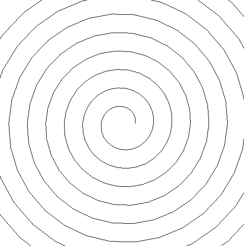
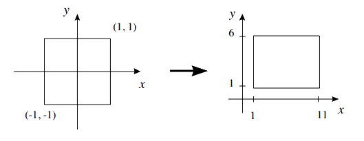
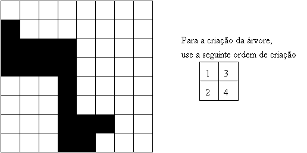

# Lista de Exercícios
## Revisão para a prova

As questões 1 a 3 referem-se cada uma a um programa em OpenGL/GLUT cujo trecho referente
à _callback_ de desenho é retratado em cada questão. Considere que o sistema
de coordenadas do mundo está definido como:

```c
glOrtho(-10, 10, -10, 10, -2, 2);
```

**Questão 1**: Mostre a imagem gerada pelo trecho de programa em OpenGL dado
a seguir.

```c
void DesenhaObjeto() {
  glBegin(GL_TRIANGLES);
    glVertex2f(-1, -1);
    glVertex2f( 1, -1);
    glVertex2f( 0,  0.7f);
  glEnd();
}

void Desenha() {
  glClear(GL_COLOR_BUFFER_BIT);
  glLoadIdentity();
  glColor3f(0, 0, 0);
  glScalef(4, 4, 4);
  DesenhaObjeto();
  glScalef(.25f, .25f, .25f);
  glColor3f(1, 1, 1);
  DesenhaObjeto();
  glFlush();
}
```

**Questão 2**: Mostre a imagem gerada pelo trecho de programa em OpenGL dado
a seguir. Numere os desenhos de acordo com os comentários do código fonte.

Dica: lembre-se da aula sobre composição de transformações. Prefira pensar que uma transformação
está [transformando não o objeto, mas o sistema de coordenadas inteiro](http://fegemo.github.io/cefet-cg/classes/hierarchical/#10).

```c
void DesenhaObjeto() {
  glBegin(GL_LINE_STRIP);     // Atente: não é GL_LINE_LOOP
    glVertex2f(0,0);
    glVertex2f(2,0);
    glVertex2f(2,2);
    glVertex2f(0,2);
  glEnd();
}

void Desenha() {
  glClear(GL_COLOR_BUFFER_BIT);
  glLoadIdentity();
  glColor3f(0, 0, 0);
  glTranslatef(5,0,0);
  desenhaObjeto();            // Figura 1 (preta)
  glPushMatrix();
    glTranslatef(-10,0,0);
    glColor3f(1, 0, 0);
    desenhaObjeto();          // Figura 2 (verm.)
    glPushMatrix();
      glRotatef(90,0,0,1);    // (+): sent. anti-hor.
      glTranslatef(0,-5,0);
      glColor3f(0, 1, 0);
      desenhaObjeto();        // Figura 3 (verde)
    glPopMatrix();
    glRotatef(-90,0,0,1);     // (-): sent. horário
    glTranslatef(0,5,0);
    glColor3f(0, 0, 1);
    desenhaObjeto();          // Figura 4 (azul)
  glPopMatrix();
  glFlush();
}
```

**Questão 3 - desafio**: Dada a imagem abaixo, escreva o código de uma _callback_ de desenho do GLUT (`Desenha()`) que gere esta imagem:



_Dikentinha: Uma espiral é um círculo cujo raio vai aumentando._


**Questão 4**: Sobre o _pipeline_ gráfico:
  1. Explique o que ele é, mostrando qual seu papel na Computação Gráfica.
  1. Explique quais são os três grandes estágios do _pipeline_ gráfico - qual o seu próposito, o que eles fazem, onde eles são processados etc.

**Questão 5**: Sobre o estágio do _pipeline_ de Geometria, **explique em 1 frase** cada um dos seus 5 subestágios.

**Questão 6**: Sobre as pilhas de matrizes em OpenGL (`GL_MODELVIEW`, `GL_PROJECTION`), responda:

  1. O que são elas e para que servem?
  1. Como interagimos com elas? Cite e explique brevemente 3 comandos (`glXXX`) em OpenGL que nos possibilitam usar as pilhas de alguma forma _(dica: nós vimos pelo menos 7 comandos de interação com elas)_.

**Questão 7**: O que é _Z-buffer_ ou _depth buffer_ e qual sua principal função para a renderização de imagens?

**Questão 8**: Determine um produto de matrizes homogêneas que represente a sequência de transformações geométricas que leva a janela da figura da esquerda na janela da figura da direita.



**Questão 9**: Dados três pontos P, Q e R não-colineares como é possível encontrar um vetor normal do triângulo formado por eles?

**Questão 10**: _Octrees_ são uma estrutura de dados para a representação de sólidos no espaço R³ de forma otimizada, enquanto que as _quadtrees_ trabalham no espaço R². Crie uma _quadtree_ para representar a figura abaixo:



_Sua resposta deve ser dada graficamente, <u>na forma de uma árvore</u> cujos nós são células vazias ou células que contêm outros nós._

**Questão 11**: Sobre modelos de iluminação, responda:

  1. Qual é a diferença entre um modelo de iluminação **local** e um modelo **global**?
  1. Qual é o modelo implementado pelo OpenGL?

**Questão 12**: Explique cada uma das 4 componentes do modelo de iluminação local de _Phong_:

  1. Emissiva
  1. Ambiente
  1. Difusa
  1. Especular

**Questão 13**: Qual é o impacto em uma imagem renderizada de se alterar (aumentar, diminuir) o valor do coeficiente de especularidade do material aplicado a um objeto que sofre contribuição de uma fonte de luz que tem componente especular diferente de zero?

**Questão 14**: Sobre modelos de sombreamento constante, _Gouraud_ e _Phong_, responda:

1. Discuta seu custo computacional.
1. Quais deles são oferecidos pelo OpenGL?
